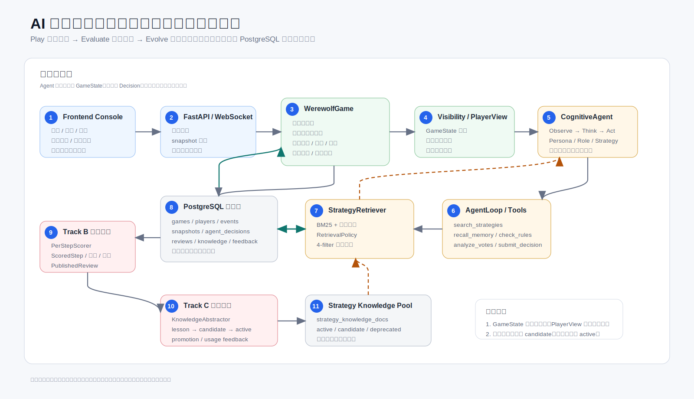
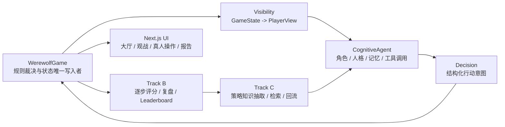
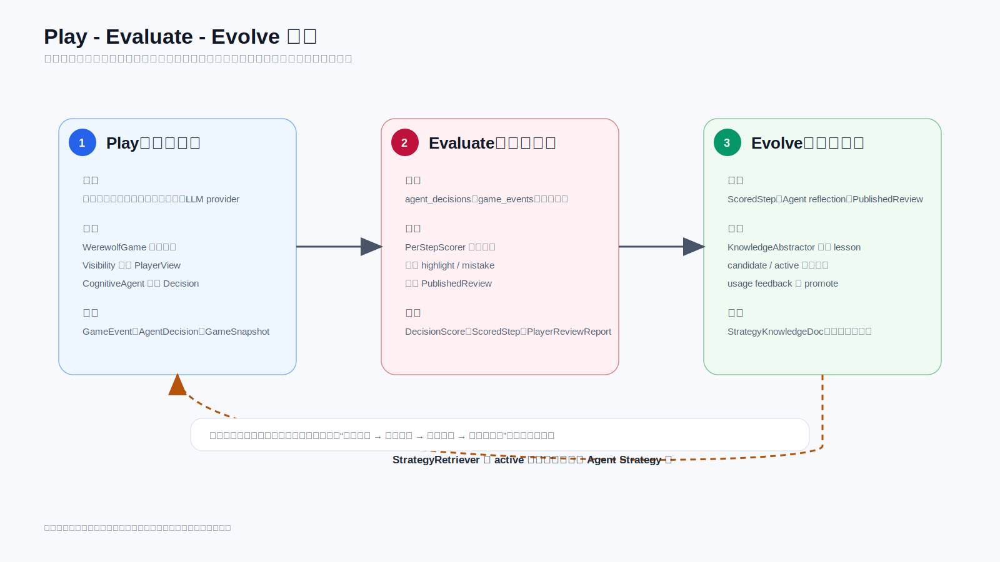
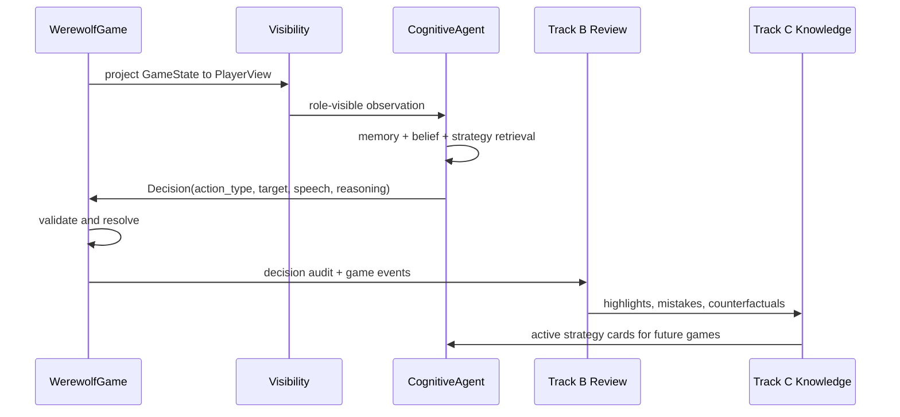

# AI Werewolf

多智能体狼人杀研究平台：让 AI 玩家在严格信息隔离下完成对局，并通过复盘评测与策略回流持续进化。

[](LICENSE)
[](https://www.python.org/)
[](https://fastapi.tiangolo.com/)
[](https://nextjs.org/)
[](https://www.postgresql.org/)
[](.github/workflows/ci.yml)

---

## 项目一句话

AI Werewolf 不是单 prompt 聊天 demo，而是一套 **Play -> Evaluate -> Evolve** 的狼人杀 Agent Team 系统：

- **Play**：规则引擎主控完整狼人杀流程，支持 7-12 人、警徽、PK、遗言、猎人开枪、白狼王自爆和真人混战。
- **Evaluate**：Track B 对每一步发言、投票和技能行动做结构化评分、复盘、报告与 leaderboard。
- **Evolve**：Track C 从复盘中抽取策略知识，经过安全过滤和检索回流到下一局 Agent。

它的核心研究问题是：在隐藏身份、欺骗、协作和不完全信息环境中，如何构建可运行、可观测、可评估、可进化的多智能体系统。

---

## 架构总览

<p align="center">
  
</p>



关键设计边界：

| 边界 | 设计 |
|---|---|
| 规则边界 | `WerewolfGame` 是真实状态唯一写入者；Agent 只能提交 `Decision`。 |
| 信息边界 | Agent 只接收 `PlayerView`，不会看到上帝视角 `GameState`。 |
| 行动边界 | 引擎校验阶段、角色、目标、生死状态和胜负条件。 |
| 证据边界 | 决策原始输出、解析结果、工具 trace、检索策略和评分结果可追溯。 |
| 进化边界 | Track C 只回流经过生命周期、安全过滤和适用性过滤的策略。 |

---

## 核心能力

| 模块 | 能力 | 入口 |
|---|---|---|
| 游戏引擎 | 夜晚行动、白天发言、投票、死亡结算、胜负判定、警徽/PK/遗言等扩展流程 | `backend/engine/` |
| 信息隔离 | 私有身份、夜间行动、狼队信息和公开视角分层投影 | `backend/engine/visibility.py` |
| CognitiveAgent | MBTI 人格、角色目标、记忆、社交模型、规划器、工具调用决策 | `backend/agents/cognitive/` |
| LLM 接入 | 统一 `create_client()`，支持 doubao / dsv4flash / ark / deepseek / anthropic / weapi / mimo / fake | `backend/llm/` |
| Track B | 单步评分、复盘报告、runtime metrics、leaderboard | `backend/eval/` |
| Track C | 策略抽取、知识生命周期、检索策略、usage feedback | `backend/eval/` + `backend/agents/cognitive/retrieval_prod.py` |
| 前端 | 大厅、对局观战、真人操作、复盘仪表盘、人格管理、单局报告 | `frontend/app/` |
| 实验 | Track B/C leaderboard、检索消融、模块效果评估、真实 LLM smoke | `scripts/` |

---

## Play -> Evaluate -> Evolve

<p align="center">
  
</p>



---

## 当前量化结果

最新模块级评估见 [`docs/MODULE_EFFECT_EXPERIMENT_RESULTS.md`](docs/MODULE_EFFECT_EXPERIMENT_RESULTS.md)。

| 指标 | 当前结果 |
|---|---:|
| 核心模块达标 | 14 / 14 |
| 平均模块效果分 | 90.79 / 100 |
| 严格 v4flash formal evidence rows | 59 |
| Track C 检索 P@3 | 0.2821 |
| Track C 检索 nDCG@5 | 0.9587 |
| Track C 检索 coverage | 1.0000 |
| Track C candidate leakage | 0 |
| 信息隔离 gate | 92 passed, 0 failed |
| strict decision fallback / invalid | 0 / 0 |

实验口径：整局 API 失败、超时和外部运行错误作为 run-health 披露，不计为 Agent 输局；胜率因果结论需要 paired target-seat A/B 支撑。

---

## 快速开始

### 1. 安装依赖

```bash
pip install -r requirements.txt
cd frontend && npm install --legacy-peer-deps
```

### 2. 配置环境

```bash
cp .env.example .env
```

在 `.env` 中设置 `LLM_PROVIDER` 和对应 key。真实 key 只放 `.env`，不要提交到 Git。

离线测试可以使用 fake provider：

```bash
export _TEST_ALLOW_FAKE_LLM=true
export LLM_PROVIDER=fake
```

### 3. 启动数据库

```bash
docker run -d --name werewolf-pg \
  -e POSTGRES_USER=werewolf \
  -e POSTGRES_PASSWORD=werewolf_dev_password \
  -e POSTGRES_DB=werewolf \
  -p 5433:5432 postgres:16-alpine
```

如果没有设置 `DATABASE_URL`，后端会使用 SQLite fallback；正式实验建议使用 PostgreSQL。

### 4. 启动后端和前端

```bash
make dev
# http://localhost:8000/docs
```

```bash
cd frontend
npm run dev
# http://localhost:3001
```

---

## 常用验证

```bash
# 离线测试，无真实 LLM 调用
_TEST_ALLOW_FAKE_LLM=true LLM_PROVIDER=fake python -m pytest tests/ -q

# 后端 lint / format check
ruff check backend/ scripts/ tests/ configs/
ruff format --check backend/ scripts/ tests/ configs/

# 信息隔离严格检查
python scripts/verify_visibility_strict.py

# 单局真实 LLM smoke，需配置真实 provider
python scripts/llm_game_smoke.py --seed 1 --max-seed 1

# 前端构建
cd frontend && npm run build
```

---

## 项目结构

```text
AIwerewolf/
├── backend/
│   ├── engine/              # 规则引擎、阶段流转、Visibility
│   ├── agents/cognitive/    # CognitiveAgent、AgentLoop、Memory、Retrieval
│   ├── eval/                # Track B/C 评分、复盘、进化
│   ├── llm/                 # LLM 客户端封装
│   ├── db/                  # SQLAlchemy models + persistence
│   └── protocols/           # Room schema / WebSocket / RoomManager
├── frontend/
│   ├── app/                 # Next.js App Router 页面
│   ├── components/          # UI 与 game 组件
│   ├── hooks/               # 对局流、真人操作、展示派生状态
│   └── lib/                 # API、i18n、展示工具
├── scripts/                 # 实验、smoke、报告生成、迁移、验证脚本
├── tests/                   # pytest + Playwright smoke
├── configs/                 # 规则、策略和实验配置
├── docs/                    # 正式文档、报告和展示资产
└── references/              # 本地参考仓库，gitignore 排除
```

---

## 主要页面

| 页面 | 路由 |
|---|---|
| 大厅 | `/` |
| AI 对局观战 | `/room/[id]/play` |
| 真人操作 | `/room/[id]/human` |
| 复盘仪表盘 | `/eval/dashboard` |
| 单局报告 | `/games/[id]/report` |
| 进化看板 | `/evolution` |
| 人格管理 | `/personas` |

---

## 文档索引

| 文档 | 说明 |
|---|---|
| [`REQUIREMENTS.md`](REQUIREMENTS.md) | 课题需求与设计目标 |
| [`docs/ARCHITECTURE_DESIGN_GUIDE.md`](docs/ARCHITECTURE_DESIGN_GUIDE.md) | 架构设计、差异化与证据索引 |
| [`docs/DATA_FLOW.md`](docs/DATA_FLOW.md) | Play -> Evaluate -> Evolve 数据流和证据链 |
| [`docs/PROJECT_MODULE_DESIGN.md`](docs/PROJECT_MODULE_DESIGN.md) | 核心模块设计 |
| [`docs/MODULE_EFFECT_EXPERIMENT_RESULTS.md`](docs/MODULE_EFFECT_EXPERIMENT_RESULTS.md) | Track B/C 与模块效果评估 |
| [`docs/TRACK_C_HERMES_LLM_WIKI_DESIGN.md`](docs/TRACK_C_HERMES_LLM_WIKI_DESIGN.md) | Track C 长期知识组织设计 |
| [`docs/PRODUCT_TECH_DOC.md`](docs/PRODUCT_TECH_DOC.md) | 产品技术文档 |
| [`docs/PROJECT_ACCEPTANCE_REPORT.md`](docs/PROJECT_ACCEPTANCE_REPORT.md) | 项目验收报告 |

---

## GitHub 提交边界

应该进入仓库：

- `backend/`、`frontend/`、`scripts/`、`tests/`、`configs/`
- 根目录说明文档和 `docs/*.md`
- 小型 SVG/HTML 展示资产、CI/部署配置

不应该进入仓库：

- `.env`、真实 API key、本地数据库、日志、`.venv`
- `data/`、`models/`、`references/`
- `node_modules/`、`.next*/`、大体积截图、实验输出 JSONL

---

## License

MIT © 2026 wxhfy
