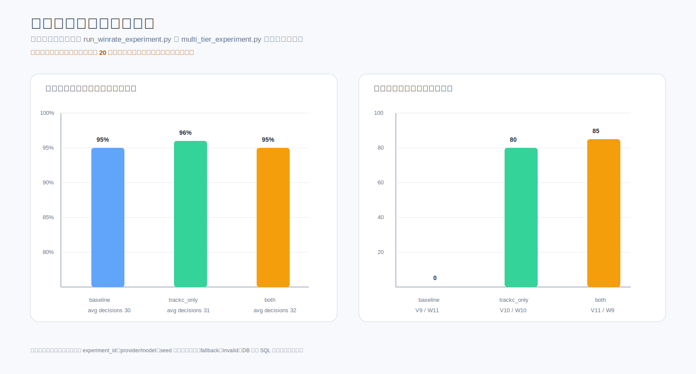
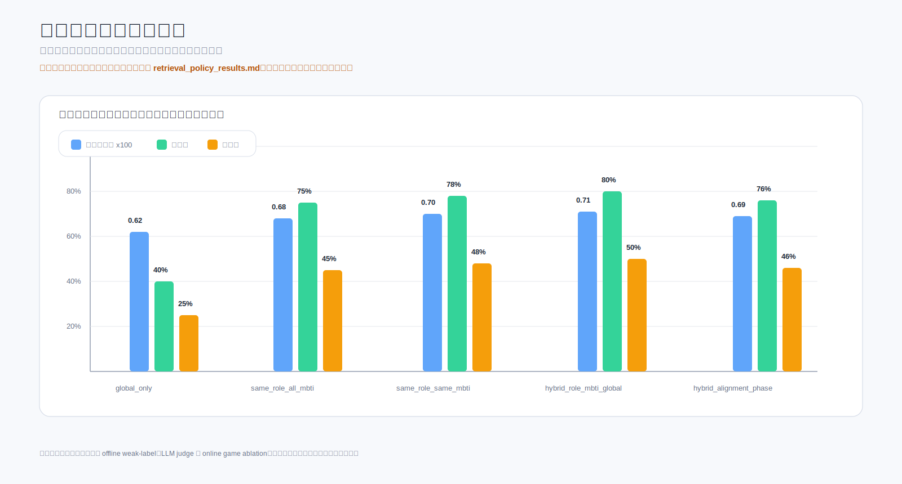

# 实验补充计划与占位图表

## 1. 多局稳定性实验计划

**目标**：验证系统能否连续跑多局，并验证 AgentDecision、Track B、Track C 链路是否稳定。

**建议命令**：

```bash
python scripts/run_winrate_experiment.py --games 20 --start-seed 3001
python scripts/run_full_llm_pipeline.py --seeds 3001 3002 3003
```

**输入**：

| 项 | 建议 |
|---|---|
| 对局人数 | 7P |
| seed | 固定连续区间 |
| provider | 真实 LLM provider |
| fallback | strict no fallback |
| DB | PostgreSQL |

**输出文件**：

| 文件 | 内容 |
|---|---|
| `outputs/winrate_report.json` | 多局结构化结果 |
| `outputs/winrate_report.md` | 人读报告 |
| PostgreSQL 查询快照 | 决策、事件、复盘指标、知识产出 |

**统计方式**：

- 局数；
- 完成率；
- 平均天数；
- 平均事件数；
- 平均决策数；
- 报错数；
- fallback 次数；
- lessons 产出；
- candidate / active 变化。

**预期图表**：

- 胜方分布柱状图；
- 每局天数分布；
- 每局决策数分布；
- 每局 lessons 产出；
- fallback / invalid 次数。

**注意事项**：

- 不混入 fake、heuristic、dry_run；
- 每局记录 provider、model、experiment_id；
- 对运行中断的局单独记录 error_type；
- 不把少量样本写成显著结论。

## 2. 检索策略对比实验计划

**目标**：比较不同 RetrievalPolicy 对策略命中、决策质量和链路稳定性的影响。

**对比方案**：

- `global_only`
- `same_role_all_mbti`
- `same_role_same_mbti`
- `hybrid_role_mbti_global`
- `hybrid_role_alignment_phase`

**建议命令**：

```bash
python scripts/evaluate_retrieval_policies.py
python scripts/evaluate_retrieval_policies_llm_judge.py
python scripts/run_retrieval_policy_ablation.py --games 20
```

**输入**：

| 项 | 建议 |
|---|---|
| active 策略池 | 实验前 snapshot |
| query set | 固定 26+ 查询 |
| online seeds | paired seeds |
| candidate 检索 | 禁止 |

**输出文件**：

| 文件 | 内容 |
|---|---|
| `outputs/retrieval_policy_eval/results.json` | 离线指标 |
| `outputs/retrieval_policy_eval/results.csv` | 表格指标 |
| `outputs/retrieval_policy_eval/per_query_details.jsonl` | 每 query 细节 |
| `outputs/retrieval_policy_ablation/results.json` | 在线对局结果 |

**统计方式**：

- 策略命中率；
- P@3；
- nDCG@5；
- Coverage；
- 检索延迟；
- tool_trace 覆盖；
- strategy_usage_feedback；
- 决策质量指标；
- 胜率仅作参考。

**预期图表**：

- P@3 / nDCG@5 对比；
- coverage 对比；
- 检索延迟箱线图；
- 在线 process score 对比。

**注意事项**：

- 不把弱标注离线分数解释为胜率提升；
- online 对照必须使用相同 seed；
- 必须记录空结果和 candidate leakage。

## 3. Track B 复盘分析有效性实验计划

**目标**：验证 Track B 复盘分析是否稳定、可解释，并与人工判断一致。

**建议命令**：

```bash
python scripts/analyze_score_distributions.py
python scripts/evaluate_track_b_vnext.py
python scripts/evaluate_human_pairwise_agreement.py
```

**输入**：

- `agent_decisions`；
- `game_events`；
- `published_reviews`；
- speech act 数据；
- 人工抽样标签。

**输出文件**：

| 文件 | 内容 |
|---|---|
| decision-quality distribution JSON/MD | 决策质量指标分布 |
| llm-review agreement JSON | LLM 复核一致性 |
| human pairwise agreement JSON | 人工一致性 |

**统计方式**：

- Tier1/Tier2/Tier3 触发比例；
- LLM review agreement；
- highlight / mistake 数量；
- 人工抽样一致性；
- 不同角色决策质量指标分布。

**预期图表**：

- 决策质量指标直方图；
- Tier 触发比例饼图；
- highlight / mistake 堆叠图；
- LLM review agreement 箱线图。

**注意事项**：

- 代码注释中的 85/12/3 是设计说明，不能当作真实分布；
- 人工抽样需保存样本 ID 和标注标准；
- 低样本角色应标注 low sample。

## 4. Track C 知识回流实验计划

**目标**：验证知识抽取、candidate 晋级、active 池变化和策略使用反馈。

**建议命令**：

```bash
python scripts/promote.py --mode quality
python scripts/promote.py --mode feedback
python scripts/multi_tier_experiment.py --games-per-tier 20
```

**输入**：

| 项 | 建议 |
|---|---|
| active snapshot | 实验前冻结 |
| candidate pool | 记录初始数量 |
| seeds | paired seeds |
| tiers | baseline / anti_only / trackc_only / both |
| fallback | strict no fallback |

**输出文件**：

| 文件 | 内容 |
|---|---|
| strategy snapshot JSON | active 池冻结信息 |
| promotion summary | 晋级结果 |
| multi-tier JSONL | 对局结果 |
| knowledge_usage_feedback SQL snapshot | 使用反馈 |

**统计方式**：

- lessons 产出；
- candidate 晋级率；
- active 池变化；
- deprecated 数量；
- 策略使用反馈；
- 回流前后决策质量指标趋势；
- invalid / fallback 次数。

**预期图表**：

- candidate -> active 晋级漏斗；
- active / candidate / deprecated 状态变化；
- strategy usage feedback 分布；
- 回流前后过程分折线。

**注意事项**：

- 新抽取 lesson 不得自动进入 active；
- 必须记录 TIER_EXPERIMENT_ID；
- 不平衡完成数不能写成提升结论。

## 5. 前端展示验证计划

**目标**：验证 WebSocket 稳定性、snapshot 延迟、视角切换正确性和可视化完整性。

**建议命令**：

```bash
make dev
cd frontend && npm run dev
node tests/ui_smoke.mjs
```

**输入**：

- 固定 game_id；
- 新建房间；
- 公开视角；
- 主持视角；
- 人类玩家操作路径。

**输出文件**：

| 文件 | 内容 |
|---|---|
| screenshots | 桌面和移动端截图 |
| UI smoke log | 交互检查结果 |
| WebSocket trace | snapshot 延迟和断线记录 |

**统计方式**：

- WebSocket 断线次数；
- snapshot 平均延迟；
- 阶段显示正确率；
- 视角字段泄露检查；
- UI 错误数；
- 移动端文本溢出检查。

**预期图表**：

- snapshot 延迟折线；
- 页面截图矩阵；
- 公开/主持视角字段差异表。

**注意事项**：

- 公开视角不能显示未公开身份；
- 夜间私有事件需要脱敏；
- 移动端和桌面均需截图。

## 6. 占位图表模板

### 6.1 多局稳定性占位表

以下为占位数据，后续需用真实实验替换。占位值用于可视化，不写入正式结论。



| 指标 | baseline（占位） | anti_only（占位） | trackc_only（占位） | both（占位） | hybrid_retrieval（占位） |
|---|---:|---:|---:|---:|---:|
| 局数 | 20 | 20 | 20 | 20 | 20 |
| 完成率 | 95% | 96% | 96% | 95% | 96% |
| 平均天数 | 2.8 | 2.7 | 2.9 | 3.0 | 2.9 |
| 平均事件数 | 58 | 57 | 61 | 63 | 62 |
| 平均决策数 | 30 | 29 | 31 | 32 | 32 |
| 平均 ScoredStep | 30 | 29 | 31 | 32 | 32 |
| 平均 lessons | 0 | 0 | 80 | 85 | 82 |
| 平均 candidate 增量 | 0 | 0 | 150 | 160 | 155 |
| fallback | 0 | 0 | 0 | 0 | 0 |
| invalid | 0 | 0 | 0 | 0 | 0 |
| 胜方分布 | V9 / W11 | V8 / W12 | V10 / W10 | V11 / W9 | V10 / W10 |

### 6.2 检索策略占位表

以下为占位数据，后续需用真实在线实验替换。离线弱标注、LLM 复核与在线对局应分开呈现。



| Policy | 平均决策分 | P@3 | nDCG@5 | 策略命中率 | 策略使用率 | 平均延迟 | candidate 泄露数 |
|---|---:|---:|---:|---:|---:|---:|---:|
| global_only | 0.62 | 0.42 | 0.50 | 40% | 25% | 25ms | 0 |
| same_role_all_mbti | 0.68 | 0.76 | 0.81 | 75% | 45% | 30ms | 0 |
| same_role_same_mbti | 0.70 | 0.78 | 0.83 | 78% | 48% | 32ms | 0 |
| hybrid_role_mbti_global | 0.71 | 0.80 | 0.85 | 80% | 50% | 35ms | 0 |
| hybrid_role_alignment_phase | 0.69 | 0.76 | 0.82 | 76% | 46% | 37ms | 0 |

### 6.3 Track B 占位表

以下为占位数据，后续需用真实复盘指标统计替换。

| Tier | 触发比例（占位） | 平均分（占位） | highlight 占比（占位） | mistake 占比（占位） | 备注 |
|---|---:|---:|---:|---:|---|
| Tier1 deterministic | 85% | 0.66 | 8% | 12% | 规则可判定 |
| Tier2 light LLM | 12% | 0.63 | 10% | 15% | 模糊决策 |
| Tier3 multi-review | 3% | 0.61 | 18% | 22% | 高影响决策 |

### 6.4 Track C 占位表

以下为占位数据，后续需用真实知识库 snapshot、promotion summary 和 usage feedback 替换。

| 指标 | baseline（占位） | trackc_only（占位） | both（占位） | 后续替换方式 |
|---|---:|---:|---:|---|
| lessons 产出 | 0 | 1600 | 1700 | `strategy_knowledge_docs` 和 Track C 输出 |
| candidate 新增 | 0 | 3000 | 3200 | active/candidate snapshot diff |
| active 新增 | 0 | 80 | 90 | `scripts/promote.py` 输出 |
| deprecated 数量 | 0 | 5 | 8 | lifecycle 统计 |
| usage feedback | 0 | 900 | 980 | `knowledge_usage_feedback` |
| active 池污染 | 0 | 0 | 0 | candidate leakage / active delta 检查 |

### 6.5 前端验证占位表

以下为占位数据，后续需用 Playwright / WebSocket trace 替换。

| 指标 | 占位值 | 后续替换方式 |
|---|---:|---|
| 平均 snapshot 延迟 | 120ms | WebSocket trace |
| 断线次数 | 0 | UI smoke log |
| 视角泄露数 | 0 | 字段 diff |
| 移动端文本溢出 | 0 | screenshot review |

## 7. 后续真实数据替换说明

1. 任何占位表替换前必须保留原始 JSON/JSONL/CSV/LOG。
2. 图表中所有真实数字必须标注来源文件和生成命令。
3. 如果实验失败局较多，必须报告失败数和 error_type。
4. 胜率不应作为 Track C 唯一指标，应同时报告过程分、策略使用、fallback 和 invalid。
5. 不同日期数据库快照不可混用；正式报告应指定冻结时间点。
