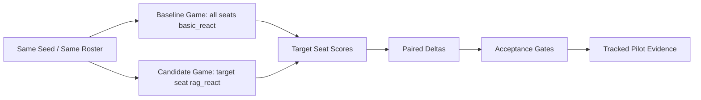

# Target-seat Track C 真实 LLM Pilot 证据

生成时间：2026-06-09T17:15:35+08:00

本文档汇总当前可用的 target-seat Track C 真实 LLM paired A/B pilot。

## 1. 实验定位

| 项目 | 值 |
| --- | --- |
| Source | outputs/target_seat_trackc_ab_seer_ark_pilot_20260609/target_seat_ab_Seer_20260609T082838Z.json |
| Raw source tracked | False |
| Claim scope | pipeline_pilot_not_accepted |
| Runner | target_seat_trackc_ab_experiment.py |
| Target role | Seer |
| Baseline -> Candidate | basic_react -> rag_react |
| Player count / max days | 7 / 20 |
| Model pool | anthropic:deepseek-v4-flash[1m] |

## 2. 核心结果

| Metric | Value |
| --- | --- |
| Paired seeds | 23 |
| Completed baseline/candidate | 23 / 23 |
| Adjusted delta | 6.2817 |
| Role-task delta | 0.0954 |
| Process delta | 6.1383 |
| Target win delta | 0.0435 |
| Candidate decisions | 875 |
| Fallback / invalid | 0 / 0 |
| Accepted | False |

## 3. Bootstrap CI 与验收门禁

| Delta | Mean | CI95Low | CI95High | CI crosses zero |
| --- | --- | --- | --- | --- |
| adjusted_final_score | 6.2817 | -5.1508 | 16.9720 | True |
| role_task_score | 0.0954 | -0.0453 | 0.2244 | True |
| process_score | 6.1383 | -5.3535 | 17.8543 | True |
| target_win_rate | 0.0435 | 0.0000 | 0.1304 | True |

| Gate | Passed |
| --- | --- |
| enough_samples | True |
| strict_health | True |
| score_gate | True |
| role_task_gate | True |
| win_gate | True |
| ci_gate | False |
| improvement_gate | True |

## 4. Paired Seed 明细

| Seed | Seat | BaseWinner | CandWinner | AdjustedDelta | RoleTaskDelta | ProcessDelta | CandDecisions | CandFallback | CandInvalid |
| --- | --- | --- | --- | --- | --- | --- | --- | --- | --- |
| 9801 | 4 | wolf | wolf | 36.8200 | -0.1750 | 40.9100 | 34 | 0 | 0 |
| 9802 | 4 | wolf | wolf | -2.8800 | -0.1750 | -3.2000 | 35 | 0 | 0 |
| 9803 | 7 | wolf | wolf | 58.9000 | 0.7300 | 65.4400 | 37 | 0 | 0 |
| 9804 | 1 | wolf | wolf | 30.1000 | 0.7300 | 29.5500 | 62 | 0 | 0 |
| 9805 | 4 | wolf | wolf | -19.6000 | 0.3050 | -21.7800 | 33 | 0 | 0 |
| 9806 | 3 | wolf | wolf | -20.7800 | 0.2600 | -23.0900 | 28 | 0 | 0 |
| 9807 | 5 | wolf | wolf | 4.8800 | 0.0583 | 5.4200 | 59 | 0 | 0 |
| 9808 | 3 | wolf | wolf | 0.0000 | 0.0000 | 0.0000 | 41 | 0 | 0 |
| 9809 | 2 | wolf | wolf | 21.2300 | 0.5100 | 23.6000 | 35 | 0 | 0 |
| 9810 | 3 | wolf | wolf | 30.0200 | 0.0450 | 30.3600 | 47 | 0 | 0 |
| 9811 | 4 | wolf | wolf | -26.7000 | 0.0000 | -29.6800 | 33 | 0 | 0 |
| 9812 | 1 | wolf | wolf | -61.0700 | -0.8600 | -63.9600 | 5 | 0 | 0 |
| 9813 | 7 | wolf | wolf | -3.7900 | 0.1750 | -4.2200 | 45 | 0 | 0 |
| 9814 | 6 | wolf | wolf | 14.1100 | -0.1750 | 17.0200 | 28 | 0 | 0 |
| 9815 | 4 | wolf | wolf | 38.7000 | 0.1750 | 41.6700 | 45 | 0 | 0 |
| 9816 | 3 | wolf | wolf | 30.2600 | 0.0900 | 31.4000 | 48 | 0 | 0 |
| 9817 | 6 | wolf | wolf | -0.1900 | 0.0583 | -0.2200 | 51 | 0 | 0 |
| 9818 | 6 | wolf | wolf | -16.2900 | 0.0050 | -15.8800 | 29 | 0 | 0 |
| 9819 | 2 | wolf | wolf | 6.8300 | 0.2600 | 7.5900 | 23 | 0 | 0 |
| 9820 | 2 | wolf | wolf | -0.3100 | 0.0000 | -0.3500 | 34 | 0 | 0 |
| 9821 | 6 | wolf | wolf | -19.6000 | 0.3050 | -21.7800 | 34 | 0 | 0 |
| 9822 | 7 | wolf | village | 18.2200 | 0.0467 | 5.2500 | 50 | 0 | 0 |
| 9823 | 2 | wolf | wolf | 25.6200 | -0.1750 | 27.1300 | 39 | 0 | 0 |
