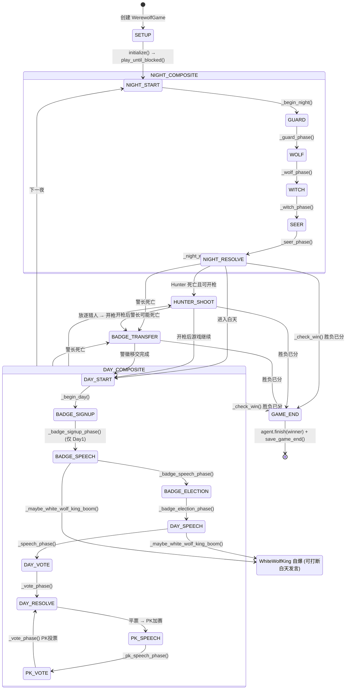

# Part 2: 游戏引擎运行流程审计

> 审计日期: 2026-05-28 | 状态: 只读 | 证据来源: `backend/engine/game.py` (1400行), `backend/engine/phases.py`, `backend/engine/models.py`, `backend/engine/visibility.py`, `backend/engine/rules.py`

---

## 2.1 完整状态机图



---

## 2.2 每个阶段对应代码入口

### 游戏初始化

| 步骤 | 代码入口 | 文件:行号 |
|------|---------|-----------|
| 创建 WerewolfGame | `WerewolfGame.__init__()` | `game.py:80` |
| 角色配置 | `get_role_configuration(player_count)` | `rules.py:69` |
| 创建玩家 | `build_players(roles, seed)` | `rules.py:47` |
| 创建 GameState | `GameState(...)` | `models.py:152` |
| 采样 Persona | `sample_personas(count, seed)` | `persona_db.py` |
| 创建角色 | `build_character_roster()` | `characters.py` |
| 创建 Agent | `create_agents(players, config)` | `factory.py` |
| 初始化对局 | `WerewolfGame.initialize()` | `game.py:145` |
| 日志 GAME_START | `_log(...)` | `game.py:155` |
| Agent 初始化 | `agent.initialize(view, game_setting)` | `game.py:148` |
| 日志 PRIVATE_INFO | `_log(...)` 每个玩家记录身份 | `game.py:151` |

### 夜晚阶段

| 步骤 | 代码入口 | 文件:行号 | 输入 | 输出 |
|------|---------|-----------|------|------|
| 夜晚开始 | `_begin_night()` | `game.py:365` | day++ | Phase=NIGHT_START, 重置投票 |
| 守卫守护 | `_guard_phase()` | `game.py:377` | guard Agent | GUARD Decision, 记录 guard_target_id |
| 狼人刀人 | `_wolf_phase()` | `game.py:413` | wolf Agents | ATTACK Decisions, 多数决确定目标 |
| 女巫用药 | `_witch_phase()` | `game.py:472` | witch Agent | WITCH_SAVE/WITCH_POISON/SKIP Decisions |
| 预言家查验 | `_seer_phase()` | `game.py:544` | seer Agent | DIVINE Decision, 记录 seer_result |
| 夜晚结算 | `_night_resolve()` | `game.py:567` | 所有夜晚动作 | 死亡列表, 触发 Hunter/Badge |

**信息隔离**: 每个夜晚动作日志使用 `visibility="private"` + `visible_to=[actor_id]`。
狼人团队讨论日志使用 `visible_to=[所有狼人ID]`。
预言家查验结果仅 `visible_to=[seer_id]`。

### 白天阶段

| 步骤 | 代码入口 | 文件:行号 | 输入 | 输出 |
|------|---------|-----------|------|------|
| 白天开始 | `_begin_day()` | `game.py:618` | - | Phase=DAY_START, 重置发言者/投票 |
| 警长竞选报名 | `_badge_signup_phase()` | `game.py:640` | (仅 Day1) | 2-3 候选人 |
| 竞选发言 | `_badge_speech_phase()` | `game.py:670` | 候选人 | CHAT_MESSAGE |
| 警长选举 | `_badge_election_phase()` | `game.py:700` | 非候选人投票 | badge.holder_id |
| 白天发言 | `_speech_phase()` | `game.py:747` | 所有存活玩家 | CHAT_MESSAGE × N |
| 投票 | `_vote_phase()` | `game.py:783` | 存活玩家 | 投票记录 (警长 1.5 票) |
| PK 加赛发言 | `_pk_speech_phase()` | `game.py:830` | PK 玩家 | CHAT_MESSAGE |
| 放逐结算 | `_day_resolve()` | `game.py:845` | 投票结果 | 死亡/白痴存活, 遗言, Hunter 触发 |

### 特殊阶段

| 步骤 | 代码入口 | 文件:行号 |
|------|---------|-----------|
| 猎人开枪 | `_hunter_shoot()` / `_hunter_shoot_from_pending()` | `game.py:930` |
| 白狼王自爆 | `_maybe_white_wolf_king_boom()` / `_white_wolf_king_boom()` | `game.py:960` |
| 警徽移交 | `_badge_transfer_from_pending()` | `game.py:1000` |
| 胜负判定 | `_check_win()` | `game.py:1050` |
| 遗言 | `_last_words_phase()` | `game.py:910` |

### 主循环入口

| 方法 | 文件:行号 | 作用 |
|------|---------|------|
| `play()` | `game.py:220` | 主入口, 循环调用 play_until_blocked() |
| `play_until_blocked()` | `game.py:270` | 核心 dispatch: 根据 phase 路由到 NIGHT_START/DAY_START/HUNTER_SHOOT/BADGE_TRANSFER |
| `submit_human_action()` | `game.py:310` | 接收人类输入, 恢复 play_until_blocked() |

---

## 2.3 信息隔离实现

### 核心类: `Visibility` (`backend/engine/visibility.py`)

**`PlayerView`** 为每个玩家构建专属视角:

```python
PlayerView:
  self_player:     dict  # 完整私有信息 (role, alignment, persona)
  players:         list  # 其他人: 狼队友看全部, 非狼看 public
  public_events:   list  # visibility="public" 的事件
  private_events:  list  # 仅 visible_to 包含该玩家的事件
  known_wolves:    list  # 狼人才能看到的狼队友完整信息
```

**关键规则**:
- 非狼玩家看不到其他人的角色/阵营 (调用 `public_dict()` 过滤)
- 狼队友互相可见完整角色信息 (`private_dict()`)
- 夜晚动作日志仅对行动者可见
- 狼人讨论日志仅对狼队可见

### 主持人视角
`GameState.moderator_dict()` 返回所有信息 (无过滤)，用于开发调试和 Track B 复盘。

---

## 2.4 关键设计特性

| 特性 | 状态 | 实现位置 |
|------|------|---------|
| 完整对局流转 | ✅ | game.py play_until_blocked() |
| 人机混战 | ✅ | human_seat 参数 + HumanAgent |
| 前端观战 | ✅ | WebSocket /ws/rooms/{room_id} |
| 断点续跑 | ✅ | phase_done 追踪 + play_until_blocked() idempotent |
| 警长系统 | ✅ | BadgeState + 1.5 票权重 |
| PK 加赛 | ✅ | pk_targets + 重跑 speech/vote/resolve |
| 白痴技能 | ✅ | 首次放逐存活, 失去投票权 |
| 白狼王自爆 | ✅ | 白天发言中自爆, 带人+打断发言 |
| 猎人开枪 | ✅ | 死亡时触发 (夜晚毒杀除外) |
| 最大天数 | ✅ | max_days 超时 → 狼人胜 |

### 信息隔离验证

| 检查项 | 结果 | 证据 |
|--------|------|------|
| Agent 不能看到不该看的信息 | ✅ | `_visible_player()` 过滤非狼玩家角色 |
| public state 和 private state 分开 | ✅ | `public_dict()` vs `private_dict()` vs `moderator_dict()` |
| 夜晚信息不泄露到白天 prompt | ✅ | private_events 仅对行动者可见 |
| 狼人不知道神职身份 (除非查验) | ✅ | 非狼可见信息仅含 public_dict() |
| 预言家查验结果仅自己可见 | ✅ | PRIVATE_INFO 事件 visible_to=[seer_id] |

---

## 2.5 行动校验 (`backend/engine/actions.py`)

`ActionValidator.validate(state, decision)` 检查:
1. 角色匹配 — 行动类型允许的角色 (如 DIVINE 仅 Seer)
2. 存活检查 — 行动者必须存活 (Hunter 开枪除外)
3. 白痴投票 — 已翻牌白痴不能投票
4. 目标检查 — 目标存在/存活/非自身
5. 连续守卫 — 不能连续守同一人 (在 `_guard_phase()` 中额外检查)

---

## 2.6 日志结构

### GameEvent (`backend/engine/models.py`)
```python
GameEvent:
  id:           str       # UUID
  timestamp:    float
  day:          int
  phase:        Phase     # enum
  type:         EventType # enum: GAME_START/PHASE_CHANGED/PRIVATE_INFO/
                          #        CHAT_MESSAGE/NIGHT_ACTION/VOTE_CAST/
                          #        PLAYER_DIED/HUNTER_SHOT/WWK_BOOM/
                          #        SYSTEM_MESSAGE/GAME_END
  visibility:   str       # "public" | "private"
  actor_id:     str|None
  target_id:    str|None
  payload:      dict      # 灵活内容
  visible_to:   list[str] # 私有事件可见玩家列表
```

### AgentDecision (`backend/db/models.py`)
```python
AgentDecision:
  game_id, player_id, day, phase
  observation:       JSON   # 当时可见状态快照
  legal_actions:     JSON
  prompt_version:    str
  raw_output:        str    # LLM 原始输出
  parsed_action:     JSON   # 解析后的结构化决策
  is_valid:          bool
  error_type:        str|None
  latency_ms:        int
  prompt_tokens:     int
  completion_tokens: int
```

### DecisionAudit (内存中)
```python
DecisionAudit:
  observation_snapshot, prompt_version, raw_output,
  parsed_action, error, latency_ms, token_usage
```
存储在 `GameState.decision_records` 中，对局结束时写入 DB。

---

## 2.7 未接入引擎的角色

以下角色在 `backend/engine/roles/` 中注册但 `playable=False`，引擎未实现对应逻辑:

| 角色 | 注册位置 | 未实现功能 |
|------|---------|-----------|
| Cupid (丘比特) | `wolfcha.py` | 情侣系统 (night zero 绑定) |
| BigBadWolf (大灰狼) | `wolfcha.py` | 神全死后额外一刀 |
| WolfCub (狼崽子) | `wolfcha.py` | 死亡时狼队多一刀 |
| WolfKing (狼王) | `extensions.py` | 死亡时开枪 |
| Knight (骑士) | `extensions.py` | 白天决斗 |
| Elder (长者) | `extensions.py` | 首次狼刀免疫 |

---

## 2.8 关键审计结论

1. ✅ **游戏引擎完整可用** — 7~12 人板子全流程覆盖
2. ✅ **信息隔离严格** — 通过 Visibility + visible_to 双重过滤
3. ✅ **支持人机混战** — HumanAgent + pending_input 机制
4. ✅ **支持前端实时观战** — WebSocket 推送快照流
5. ✅ **支持断点续跑** — phase_done 追踪已完成的阶段
6. ⚠️ **模板角色未接入** — 6 个角色仅注册但无引擎逻辑
7. ✅ **夜晚信息不泄露** — 每个私有事件仅对行动者可见
