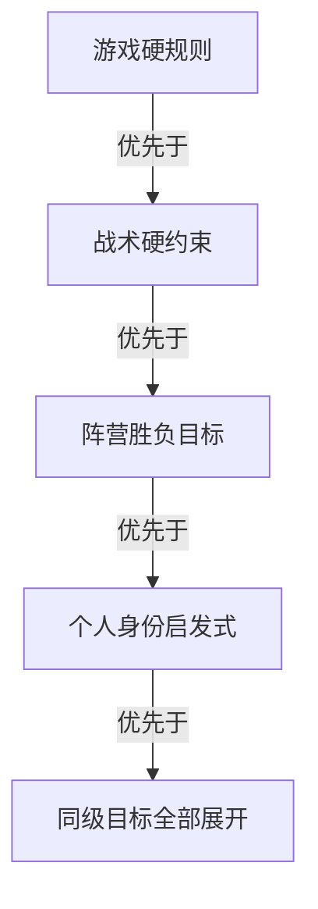
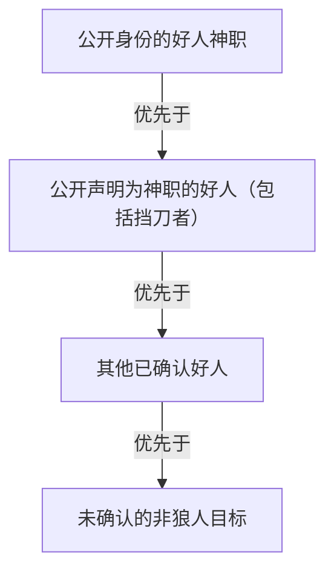

# Search Simulator 算法设计

> 归档版本 V1。该版本保留以完整 BFS/DFS 树分支迭代和固定 DAG 后处理为中心的设计；当前算法真源见 `ALGORITHM_DESIGN_V3.md`，V2 保留精确信念设计的历史上下文。

> 本文只描述研究目标、博弈模型、状态、信息约束、状态转移、分支语义、区间定义、复杂度、风险与算法不变量。
> 工程文件、持久化结构、进程边界、界面实现和验证记录不属于本文。

## 1. 研究目标与范围

本模块研究狼人杀中的零和阵营博弈。当前阶段聚焦第一天白天 cheap talk 是否改变公开票型，并进一步改变阵营终局效用。隐藏身份站位、昼夜行动、白天投票和明确选择的战术共同构成一棵有限分支树；状态合并后得到有向无环图（DAG）。算法采用完整的 BFS/DFS 树分支迭代，不实现随机游走。

好人阵营最大化好人终局效用，狼人阵营最小化好人终局效用。玩家默认具有功利理性，但“智能投票”只是信息受限的阵营优先启发式筛选，不声称已经求得全局最优、minimax、完美贝叶斯均衡或统计意义上的最优策略。

本设计的研究边界是：

- 对每一个被纳入的角色站位，展开所有满足游戏硬规则的昼夜转移；
- 在智能投票模式下，先按阵营目标和战术硬约束过滤，再对同级目标分别展开；
- 只合并未来转移完全等价的状态；
- 搜索完成后再计算 wide/narrow interval，interval 不参与任何搜索决策。
- LLM 只作为受控决策生成与分析工具，不被视为均衡求解器；至少 10 局重复属于实验稳定性观测，不自动构成无偏期望估计。

## 2. 搜索模型

### 2.1 状态树与 DAG

根节点是一个确定站位下的初始夜晚状态。每一条有向边代表一次合法的游戏行动或一组同时结算的行动。子节点是该行动结算后的完整游戏状态。

DFS 与 BFS 只改变节点取出顺序：

- DFS 优先展开最新进入 frontier 的节点，降低深度搜索的前沿内存；
- BFS 优先展开最早进入 frontier 的节点，保持按深度观察状态分布；
- 两者必须使用完全相同的状态转移、等价判定、战术分支和终局判定。

同一个状态可能由多个父节点到达。等价状态在 DAG 中共享一个节点，但不同父子边的行动、目标、战术和公开信息原因必须分别保留。

### 2.2 站位世界

默认研究板子为 7 人：2 狼人、1 预言家、1 女巫、1 守卫、2 村民。狼人是不可区分的同类角色，因此默认唯一站位数为：

$$
N_{\mathrm{layout}}=\frac{7!}{2!\,2!}=1260
$$

当前 cheap-talk 实验不启用愚者或其他扩展角色。不同站位仍表示不同的隐藏身份世界，不能因为当前公开状态相同而跨站位合并。若研究配置没有另行给出先验权重，站位枚举只表示被纳入的隐藏世界集合，不自动产生真实对局中的站位概率解释。

## 3. 信息与可观测性

### 3.1 游戏视角

每个行动者的目标集合只能由其在真实对局中可获得的信息构造：

- 狼人知道狼队成员；
- 预言家知道自己的私有查验；
- 其他好人只能使用公开声明、公开查验和公开确认；
- 未公开的真实身份不能用于投票、守护、用药或狼刀目标过滤。

研究者可以在上帝视角观察真实站位，但上帝视角只用于解释和可视化，不能回流为玩家决策信息。

### 3.2 死亡与身份公开

死亡本身不公开身份，也不删除玩家生前已经公开的身份信息。唯一例外是愚者白天被放逐时触发“身份揭示”。

因此，状态必须区分真实角色、公开声明、公共阵营确认和预言家私有查验；这些信息不能用一个“已知身份”字段混合表示。

## 4. GameState 与状态等价

一个状态必须足以决定未来的全部合法转移。其概念组成至少包括：

- 固定站位、每名玩家的存活状态和真实角色；
- 当前昼夜阶段、白天轮次和黑夜轮次；
- 狼刀、投票、守护、解药、毒药、查验等技能资源及其剩余次数；
- 守卫上一夜目标、女巫当前可用药物和影响下一阶段的战术目标；
- 公共身份声明、公共阵营确认、预言家私有查验；
- 愚者是否已经揭示、是否仍存活、是否已经失去投票权；
- 影响未来行动集合的公开历史和阶段上下文。

两个状态只有在未来所有合法转移、行动者可见信息、资源消耗、终局判定和公开结果均完全相同，才允许合并。仅仅“当前死者集合相同”“当前预测胜方相同”或“当前 interval 相同”都不足以证明等价。

状态签名不包含 reward、interval、父节点、边原因、路径计数、界面展开状态或其他只影响观测的字段。状态签名只描述未来转移所需的规范化游戏状态。

## 5. 当前角色与扩展角色边界

当前研究只使用狼人、平民、女巫、预言家和守卫。愚者不进入当前板子、cheap-talk 处理组或 baseline；以下语义只为兼容扩展配置保留。

愚者是好人阵营神职，技能“身份揭示”最多触发一次。愚者在白天成为放逐目标时：

1. 公开愚者身份；
2. 本次放逐不造成死亡；
3. 立即结束当天，不进行第二轮投票；
4. 愚者继续存活并计入神职存活条件；
5. 技能消耗且永久失去投票权；
6. 后续白天投票统计不包含愚者，智能投票也不再把已揭示愚者作为目标。

默认板子不启用愚者；启用时由愚者替换一名村民。

## 6. 终局与零和效用

定义存活狼人、存活好人和存活神职集合：

$$
\begin{aligned}
W &:\text{存活狼人集合},\\
G &:\text{存活好人集合},\\
C &:\text{存活神职集合}.
\end{aligned}
$$

终局判定遵循真实规则：

$$
W=\varnothing
\Longrightarrow
\text{好人胜}
$$

$$
|W|\ge|G|
\Longrightarrow
\text{狼人胜}
$$

若本局存在神职：

$$
C=\varnothing
\Longrightarrow
\text{狼人胜}
$$
- 若本局存在村民且存活村民集合为空，狼人胜；
- 以上条件均不满足时状态未结束，继续按当前阶段展开。

统一使用好人视角效用：

$$
u(z)=
\begin{cases}
+1,&z\text{ 为好人阵营胜利},\\
-1,&z\text{ 为狼人阵营胜利}.
\end{cases}
$$

## 7. 阶段转移与基线分支

每个非终局状态先按照当前阶段生成正常行动基线，再加入用户启用且满足硬约束的战术分支。战术分支增加研究路径，不替换正常基线。

### 7.1 黑夜

目标黑夜顺序为：狼人私聊归票并确定攻击目标、预言家查验、女巫行动、守卫行动、统一结算。每个行动者只能读取自己的合法信息；流程位置靠后不自动获得前序角色的私有行动结果。守救冲突、女巫同夜用药互斥和药物次数在冻结前不由算法采用常见房规补全。

非采样搜索对规则随机性进行显式分支和权重求和，不实际抽取一个随机结果。联合行动若能按死亡集合、查验更新或其他未来充分统计量无损聚合，可以合并其概率质量；若单个动作会改变未来公开历史，则仍须保留对应派生语义。

### 7.2 白天

白天不包含警徽流程。存活玩家按固定顺序各获得一次公开发言位置，随后同时投票；发言、身份声明和完整票型均属于公共历史，死者没有遗言且身份不公开。

所有合法票型都必须被考虑。平票不能按座位号裁决；“随机数投票”的规则尚未冻结。若最终定义为在最高票并列者中均匀随机放逐，则每名并列者建立一个具有精确等权质量的后继分支，而不是在运行时随机保留其中一个结果。

## 8. 智能投票

智能投票默认开启。关闭时只执行合法基线分支，战术集合为空。

对行动者构造目标集合时，优先级固定为：

具体规则如下：

- 狼人优先攻击或投票于好人阵营，排除已知狼队成员；
- 好人优先保护好人阵营，并在信息足够时优先投票已被私有或公共查验确认的狼人；
- 预言家只能使用自己的私有查验，其他好人只有在查验公开后才能使用该信息；
- 信息不足时退化为行动者自己的身份启发式，不能偷看真实站位；
- 同级目标不随机抽样、不用座位号 tie-break，必须分别扩展；
- “明显狼人行为”只作为提示性描述，不新增隐藏信息或独立分类器。

智能投票是功利理性剪枝模型，不是所有玩家共享信息的全知决策器。

## 9. 狼人夜间目标

在没有更高优先级战术指定时，狼人按以下阵营目标顺序考虑攻击对象：

公开神职内部的同级目标全部展开。若多个目标造成的未来转移完全等价，可以共享后继状态，但每个目标和战术原因仍保留在边上。

当仅剩平民与已公开的愚者且攻击结果必然导向狼人胜利时，刀口在未来转移意义上等价，可以合并以减少重复迭代；这不是基于座位号的任意裁决。

## 10. 战术分支

战术只在智能投票开启时显示并生效。每个勾选战术都在正常基线之外增加分支；若硬约束不满足，则不产生分支。

### 10.1 白天战术

#### 村民挡刀

平民在自己的公开发言位置宣称自己是预言家，用于研究该声明是否改变后续发言、白天票型和次夜狼刀。实验分别观察其位于发言顺序前四位和后三位的情况。虚假预言家是否必须给出查验对象和查验结果尚未冻结；冻结前不得沿用旧模型中“不得伪造具体查验”的假设。

#### 预言家不发言

真实预言家经过自己的发言位置但不提供有效公开信息，其私有查验继续只对本人可见。空发言、拒绝声明或最短占位文本属于不同的可观测 cheap-talk 行为，具体形式冻结后才能成为单一战术动作。

#### 狼人悍跳预言家

狼人可以在公开发言中宣称自己是预言家，分别研究其位于发言顺序前四位和后三位的情况。虚假查验是否必需、允许声明哪些查验结果以及狼队是否协同声明，均必须由显式实验配置给出，不能读取上帝视角后自动生成“最有利”谎言。

### 10.2 黑夜战术

黑夜战术保留为扩展控制变量，不属于当前第一天白天 cheap-talk 收益矩阵的三个主要处理变量。若与白天战术同时启用，必须单独标记其处理状态。

#### 狼人自刀骗解药

必须同时满足：存在女巫或守卫、存活狼人至少两名、战术已启用。每名存活狼人都作为自刀目标分别展开；正常狼刀基线保留。若未被保护或救治，该狼人按规则死亡，死亡不向好人自动公开狼人身份。

#### 狼人空刀

只有存在女巫或守卫时可启用。空刀代表无狼刀目标，不伪造玩家目标；守卫、女巫毒药、预言家和其他独立行动仍正常结算。

## 11. Baseline 与 cheap-talk 收益

Baseline 不启用平民跳预言家和狼人悍跳，真实预言家必须提供有效发言，且任何实验战术都不能先以高优先级提示注入再由低优先级提示尝试覆盖。战术组和 baseline 应共享角色站位、发言顺序、规则配置和其他控制变量，仅改变目标 cheap-talk 战术。

好人视角的处理收益定义为战术处理值与匹配 baseline 值之差：

$$
\Delta_t=V_t-V_0
$$

收益矩阵还必须保留第一日完整票型等中间观测，不能只记录终局。前置位指发言顺序前四位，后置位指后三位；目标角色是自然落入该位置还是由实验强制安排，必须在计算前明确。

每个矩阵单元必须标记数值语义：确定性策略下的精确结果、显式分支权重下的完整求和值，或重复 LLM 对局的经验均值。至少 10 局重复只用于实验稳定性观察；在 LLM 没有提供完整动作概率时，该均值不得命名为无偏决策期望。

## 12. Wide/Narrow Reward Interval

### 12.1 定位与夹逼假设

Wilson 区间、置信度和概率解释均不属于本模型。wide/narrow 是搜索完成后的观测量，不参与分支生成、智能投票、战术选择、目标排序、剪枝、状态签名或状态合并。

研究假设为真实 interval 落在 wide 与 narrow 之间：

$$
I_{\mathrm{narrow}}(v)\subseteq I_{\mathrm{true}}(v)\subseteq I_{\mathrm{wide}}(v)
$$

这是模型假设而非统计覆盖率承诺。

### 12.2 叶节点

$$
I(v)=
\begin{cases}
[1,1],&v\text{ 为好人胜利终局},\\
[-1,-1],&v\text{ 为狼人胜利终局},\\
[-1,1],&v\text{ 未决或没有可计算后继节点}.
\end{cases}
$$

### 12.3 直接子节点集合

每个节点只读取其唯一的直接子节点集合：

$$
C(v)=\{c\mid(v,c)\text{ 是直接父子关系}\}
$$

向后传播忽略父节点、多条派生原因、边 multiplicity、路径总数和跨父节点的多边合并关系。定义非空直接子节点集合的数量与子节点区间：

$$
n=|C(v)|>0,
\qquad
I_i=[L_i,U_i]
$$

$$
\overline L=\frac{1}{n}\sum_{i=1}^{n}L_i,\qquad
\overline U=\frac{1}{n}\sum_{i=1}^{n}U_i
$$

### 12.4 Wide interval

$$
L_{\mathrm{wide}}=\lambda\min_iL_i+(1-\lambda)\overline L
$$

$$
U_{\mathrm{wide}}=\lambda\max_iU_i+(1-\lambda)\overline U
$$

### 12.5 Narrow interval

始终执行 narrow 的反转设计：

$$
A=\lambda\max_iL_i+(1-\lambda)\overline L
$$

$$
B=\lambda\min_iU_i+(1-\lambda)\overline U
$$

显示前强制保持上界不小于下界：

$$
L_{\mathrm{narrow}}=\min(A,B),\qquad
U_{\mathrm{narrow}}=\max(A,B)
$$

不存在反转开关。风险参数只改变观测区间的放缩，不改变 DAG。

### 12.6 风险参数与计算时机

$$
\lambda\in[0,1],\qquad\lambda_{\mathrm{default}}=0.5
$$

interval 在搜索和完整 DAG 持久化完成后计算。用户调整风险参数时，只对已有 DAG 重新回传 wide/narrow；不重新展开搜索，也不改变状态、边、路径计数或合并关系。

### 12.7 分支颜色

分支颜色永远读取子节点的 wide interval。默认狼人效用小于零、好人效用大于零：

$$
\Delta=\left||U_{\mathrm{wide}}|-|L_{\mathrm{wide}}|\right|
$$

$$
\operatorname{color}(I_{\mathrm{wide}})=
\begin{cases}
\text{blue},&L_{\mathrm{wide}}\ge0\land U_{\mathrm{wide}}>0,\\
\text{red},&L_{\mathrm{wide}}<0\land U_{\mathrm{wide}}\le0,\\
\text{black},&L_{\mathrm{wide}}\le0\le U_{\mathrm{wide}}\land\Delta<0.001,\\
\text{blue},&L_{\mathrm{wide}}<0<U_{\mathrm{wide}}\land|U_{\mathrm{wide}}|>|L_{\mathrm{wide}}|,\\
\text{red},&L_{\mathrm{wide}}<0<U_{\mathrm{wide}}\land|U_{\mathrm{wide}}|<|L_{\mathrm{wide}}|,\\
\text{black},&I_{\mathrm{wide}}=[0,0].
\end{cases}
$$

颜色判定阈值为：

$$
\Delta<0.001
$$

同符号区间优先按阵营方向着色；只有跨零才比较两端绝对值。等距跨零区间在满足颜色判定阈值时显示黑色。

## 13. 复杂度、风险与退化方案

状态数的主要增长来自：

- 角色站位排列；
- 夜间行动的笛卡尔积；
- 白天发言、票型与战术组合；
- 同级目标分支；
- 自刀、空刀、守护、用药和死亡连锁；
- 多个父分支汇入同一等价状态。

智能投票可以删除明显违背阵营目标的候选，但不保证状态空间为多项式规模，也不保证找到全局最优策略。

当信息不足、状态不完整或无法证明某个目标严格优于其他同级目标时，退化为身份启发式并展开全部同级目标。若后继为空或搜索被中断，interval 使用：

$$
[-1,1]
$$

不得编造确定胜负。

## 14. 算法不变量

- 搜索只进行 BFS/DFS 树分支迭代，不进行随机游走；
- DFS 与 BFS 仅在取出顺序上不同；
- 智能投票默认开启，关闭时战术集合为空；
- 当前实验固定为 7 人板子，不含警徽和扩展角色；
- 白天主战术为平民跳预言家、预言家不发言和狼人悍跳预言家，baseline 不得触发这些战术；
- 游戏硬规则优先于战术，战术优先于阵营筛选，阵营筛选优先于个人启发式；
- 同级目标全部展开，不使用座位号 tie-break；
- 算法决策只能读取行动者游戏视角的信息；
- 除愚者身份揭示外，死亡不公开身份；
- 只合并未来转移完全等价的状态；
- 每条父子边保留全部派生原因；
- LRU/状态签名只描述未来转移状态；
- multiplicity 不参与 interval 向后传播；
- Wilson 与 confidence level 不存在；
- interval 只作完成后的观测量；
- LLM 重复对局均值不因重复次数达到 10 而自动获得无偏期望解释；
- narrow 始终规范化为上界不小于下界；
- 分支颜色永远基于子节点 wide interval；
- 默认风险参数固定为文中定义的默认值，动态调整风险参数不重新搜索。
