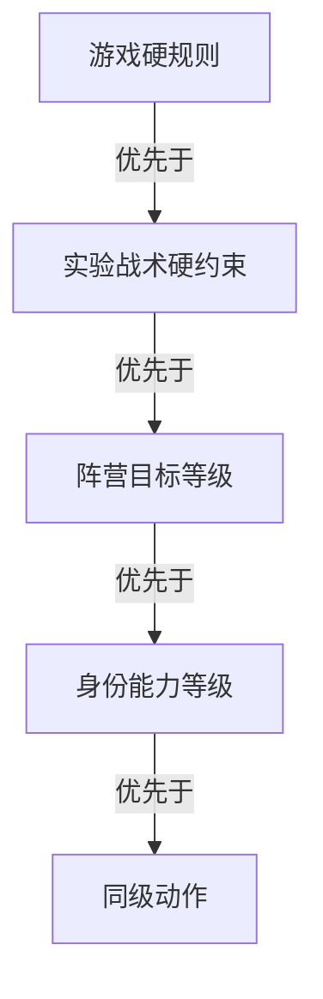

# 精确信念 Cheap-talk 决策矩阵算法设计

> 本文是当前算法真源，只描述研究目标、规则语义、信息约束、精确信念、结构化 cheap talk、模型条件策略、Monte Carlo 收益估计、复杂度、风险和算法不变量。
> 工程文件、类名、函数名、数据库表、进程与线程实现、迁移步骤和测试命令不属于本文。
> 文件名中的编号只用于文档沿革；算法、实现、日志、界面和输出均使用本标题中的功能名称。

## 1. 算法定位

精确信念 Cheap-talk 决策矩阵在有限隐藏世界精确贝叶斯信念追踪之上增加独立的“发言前决策收益层”。两层职责严格分离：

- 信念层根据行动者依法可见的信息，对有限隐藏站位和局部潜变量执行精确条件化；
- 决策层读取行动者 posterior，对结构化 cheap-talk 候选执行前向 Monte Carlo 模拟；
- 语言模型只消费最终矩阵，不参与候选生成、轨迹采样、行动评分、胜率判断或矩阵更新；
- 决策层不读取历史对局来拟合行为概率；
- 完整分支树迭代与固定 DAG 继续作为兼容验证路径，不成为发言前决策算法。

前向终局 Monte Carlo 估计只对显式规则、显式功利等级策略和显式随机机制定义的模拟世界成立。它不是对真实人类、真实语言模型行为或未知总体的无偏估计。

## 2. 研究目标与输出

当前研究仍聚焦固定七人板子中第一天白天 cheap talk 对公开票型和阵营终局收益的影响。精确信念 Cheap-talk 决策矩阵在每名存活玩家轮到第一天发言前，构建行动者视角的结构化决策收益矩阵。

给定行动者在时刻的合法信息，候选具体动作的模型条件价值定义为：

$$
V^{(i)}(a,c)
=
\mathbb E_{
\Theta\sim B_t^{(i)},
\tau\sim P_{\rho,c}(\cdot\mid do(a),\Theta,I_t^{(i)})
}
\left[u_i(\tau)\right]
$$

变量含义为：

$$
\begin{aligned}
i &:\text{当前行动者},\\
a &:\text{被评估的具体结构化发言动作},\\
c &:\text{发言证据强度},\\
B_t^{(i)} &:\text{行动者在当前时刻的精确站位 posterior},\\
\rho &:\text{具有稳定规范标识的功利等级策略},\\
\tau &:\text{从当前干预继续到终局的一条模拟轨迹},\\
u_i &:\text{行动者阵营视角的终局效用}.
\end{aligned}
$$

每个矩阵单元至少输出：

- 终局效用 Monte Carlo 样本均值；
- 相对 baseline 的配对收益差；
- Monte Carlo 标准误；
- 完成样本数；
- 六类后续反应情景频数；
- 规则、信念、策略、参数和随机数方案规范标识；
- “结果仅为模型条件估计”的语义标记。

算法只产生矩阵输出，不接收语言模型的选择、发言或偏离理由。

## 3. 固定游戏世界与规则

### 3.1 固定板子

当前研究板子为七人：两名狼人、两名平民、一名女巫、一名预言家和一名守卫。完整隐藏站位空间为：

$$
|\Omega|
=
\frac{7!}{2!\,2!}
=
1260
$$

当前实验不启用警徽、愚者、猎人、白狼王或其他扩展角色。死亡只公开席位和既有公开历史，不公开真实角色，也不提供遗言。

### 3.2 已冻结的昼夜规则

- 存活玩家按既定发言顺序逐席位发言，随后公开投票；
- 平票时在最高票并列者中均匀随机放逐一人；
- 女巫每夜只能在解药、毒药和不行动之间三选一；
- 解药和毒药各全局限用一次；
- 女巫只允许第一夜自救，不允许自毒，不允许同夜双药；
- 女巫知道本夜狼刀目标，但不知道守卫目标；
- 守卫不能守护自己，不能连续两夜守护同一目标；
- 守卫决策时不知道狼刀、女巫行动或其他玩家真实身份；
- 同一目标同时被守护和使用解药时仍然存活；
- 同一结算同时满足“所有狼人死亡”和狼人屠边条件时，先判定所有狼人死亡，好人获胜。

### 3.3 终局效用

行动者使用阵营一致的零和终局效用。好人行动者的效用为：

$$
u_{\mathrm{good}}(z)
=
\begin{cases}
+1,&z\text{ 为好人阵营胜利},\\
-1,&z\text{ 为狼人阵营胜利}.
\end{cases}
$$

狼人行动者使用相反符号：

$$
u_{\mathrm{wolf}}(z)
=
-u_{\mathrm{good}}(z)
$$

## 4. 精确信念层

### 4.1 每名玩家独立条件化

每名玩家拥有独立信念：

$$
B_t^{(i)}(\theta)
=
P(\Theta=\theta\mid I_t^{(i)})
$$

信念层对与行动者硬知识相容的站位完整枚举，不使用 Monte Carlo 近似 posterior，也不以 top-k 截断替代剩余概率质量。

收到新证据后的更新为：

$$
\widetilde B_t^{(i)}(\theta)
=
B_{t-1}^{(i)}(\theta)L_t^{(i)}(\theta)
$$

$$
B_t^{(i)}(\theta)
=
\frac{\widetilde B_t^{(i)}(\theta)}
{\sum_{\theta'}\widetilde B_t^{(i)}(\theta')}
$$

若全部候选权重为零，算法报告模型不一致并保留更新前信念，不静默恢复均匀分布。

### 4.2 角色视角硬知识

角色视角只包含规则保证为真的站位知识：

| 行动者 | 可进入硬知识的内容 |
|---|---|
| 平民 | 自身席位和确切角色 |
| 女巫 | 自身席位和确切角色 |
| 守卫 | 自身席位和确切角色 |
| 预言家 | 自身确切角色；历史查验目标及好人或狼人结果 |
| 狼人 | 自身确切角色；依法知道的狼队友席位和狼人阵营 |
| 任意角色 | 规则明确公开的真实身份事件 |

预言家查验“好人”只形成阵营约束，不能把目标固定为某个具体好人角色。扩展角色存在时，狼人默认只知道队友属于狼人阵营；只有规则明确公开子角色时才能固定精确角色。

以下内容不是角色硬知识：

- 公开跳身份；
- 发言风格、怀疑和支持；
- posterior 较高的角色猜测；
- 死亡但未公开的身份；
- 研究者知道的完整真实站位。

角色硬知识、公开状态和行动者身份共同确定合法站位集合：

$$
\Omega_t^{(i)}
=
\left\{
\theta\in\Omega
\mid
\theta\models I_{t,\mathrm{hard}}^{(i)}
\right\}
$$

### 4.3 决策状态

发言前决策状态由以下语义共同构成：

- 影响未来转移的规范游戏状态；
- 当前行动者、行动阶段和实际发言位置；
- 已发生的顺序化结构发言事件；
- 公开声明、指控、支持、反驳和投票意向；
- 行动者角色视角硬知识；
- 行动者 posterior；
- 规则、证据和策略规范标识。

父节点、界面状态、自然语言文本、研究者真值、旧 reward、wide/narrow interval 和随机执行进度不属于决策状态语义。

## 5. 结构化 Cheap-talk 动作

### 5.1 动作字段

具体发言动作至少描述：

- 发言模式；
- 身份声明；
- 声称的查验目标和结果；
- 指控目标；
- 支持目标；
- 预期投票目标；
- 沟通强度；
- 实验战术标签；
- 动作结构规范标识。

自然语言文本不进入动作定义，也不进入收益矩阵的动作键。

### 5.2 两级候选空间

为同时控制摘要规模并保留全部同级目标，候选空间分为两级：

1. 一级动作族：baseline、指控、支持、投票意向、跳预言家、沉默；
2. 二级具体动作：确定目标、查验结果、强度和战术标签后的完整动作。

一级最多六类，只用于摘要和导航。Monte Carlo 实际评估二级具体动作。同级目标不得按座位号裁掉；如果多个目标同分，必须保留全部具体动作。一级不得通过无依据等权平均把不同具体动作伪装为一个收益值。

### 5.3 实验战术语义

- 平民挡刀：平民公开声明为预言家，并给出一个其他存活席位及好人或狼人结果；
- 预言家不发言：发言位置正常经过，产生显式主动沉默事件，自然语言内容为空；
- 狼人悍跳：狼人公开声明为预言家，并给出一个其他存活席位及好人或狼人结果；
- 真预言家公开查验时只能报告真实私有查验；
- 只声明“我是预言家”但不给查验属于独立弱声明，不能和完整跳预言家合并；
- 未启用的实验战术不进入该实验单元的候选集合；
- baseline 不注入平民挡刀、预言家沉默或狼人悍跳。

前置位仍指实际发言顺序前四位，后置位仍指实际发言顺序后三位。矩阵条件化于当前实际位置；实验是否强制目标角色进入某类位置属于实验设计层决策，不由收益算法自行改变座位或发言顺序。

## 6. 发言证据强度

发言证据强度参数的范围为：

$$
c\in[0,1]
$$

当前固定观察档位为：

$$
\mathcal C
=
\{0,0.5,0.8\}
$$

它表示结构化发言证据相对中性似然的作用强度，不表示“声明为真的概率”。给定基础发言似然，插值似然为：

$$
L_c(e\mid\theta)
=
(1-c)+cL_{\mathrm{speech}}(e\mid\theta)
$$

因此：

- 零档表示忽略该发言作为身份证据；
- 中档表示中等证据影响；
- 高档表示较强证据影响；
- 除游戏硬约束外，任何档位都不得轻易制造零似然。

三个档位分别计算和展示，不用未经定义的权重合并为单一收益。

## 7. 规则内核与算法策略

### 7.1 规则内核

规则内核只回答：

- 当前阶段有哪些合法动作；
- 一个确定动作如何改变游戏状态；
- 昼夜联合动作如何结算；
- 是否达到终局以及谁获胜。

规则内核不包含行为概率、智能投票偏好、实验战术选择、Monte Carlo 采样、DAG、缓存或界面状态。

### 7.2 决策优先级

rollout policy 固定遵循：

五个规范优先等级映射为：

$$
\mathcal Q
=
\{1,0.75,0.5,0.25,0\}
$$

完全同级动作必须得到相同分数。行动概率使用固定 softmax：

$$
\pi_{\rho}(a\mid s,i)
=
\frac{
\exp\left(Q_i(s,a)/\tau_{\mathrm{policy}}\right)
}
{
\sum_{a'\in\mathcal A_i(s)}
\exp\left(Q_i(s,a')/\tau_{\mathrm{policy}}\right)
}
$$

当前策略温度固定为：

$$
\tau_{\mathrm{policy}}
=
0.25
$$

可信度参数与策略温度是不同变量，不得混用。

### 7.3 阶段评分原则

- 好人投票依据目标为狼人的行动者 posterior；
- 狼人投票和狼刀依据狼队合法信息、队友保护和公开威胁等级；
- 预言家查验依据预期信息增益；
- 守卫依据算法策略推导的受刀风险；
- 女巫依据目标阵营 posterior、药物剩余和行动机会成本；
- 后续结构化发言依据预期票型推动、自身风险和公开一致性；
- 真预言家、狼人和其他好人的私人信息严格隔离；
- 评分等级表必须具有稳定规范标识，不得由自然语言模型动态提供。

rollout policy 的隐藏世界仍从行动者完整 posterior 直接抽样；为控制未来
动作热路径成本，目标排序可以使用由行动者硬知识和公开结构证据确定性构造
的、具有独立规范标识的边缘评分投影。该投影是显式行为模型，不改变 posterior、
隐藏世界抽样分布或 Monte Carlo 无偏性所针对的模拟分布。

信息增益可由 posterior 熵变化表示：

$$
H(B)
=
-\sum_{\theta}B(\theta)\log B(\theta)
$$

$$
\operatorname{IG}(a)
=
H(B_t)-\mathbb E\left[H(B_{t+1})\mid a\right]
$$

该策略是功利理性的算法假设，不声称为全局最优、均衡或真实行为模型。

## 8. 前向 Monte Carlo

### 8.1 世界与轨迹采样

对每个具体候选动作和每个可信度档位：

1. 从行动者完整联合 posterior 直接抽取一个合法隐藏站位；
2. 在该隐藏世界中为每名模拟玩家建立依法可见的私人信息；
3. 对当前候选动作执行外部干预；
4. 后续玩家使用固定算法 rollout policy 选择结构化行动；
5. 规则随机性按照显式概率采样；
6. 一直模拟到终局；
7. 记录行动者阵营效用和反应情景。

站位空间有限，抽样直接来自离散 posterior，不使用需要 burn-in 的 Markov chain Monte Carlo。

### 8.2 非递归要求

rollout 中的未来玩家不会再次构建收益矩阵，也不会启动嵌套 Monte Carlo、MCTS 或语言模型调用。否则计算会递归膨胀，且估计目标不再固定。

### 8.3 固定样本预算

每个具体动作、每个可信度档位固定执行：

$$
N
=
100
$$

不得根据中途领先结果提前停止后仍把普通样本均值称为无偏估计。若性能基准要求修改样本数，样本数必须成为规范请求参数和结果身份的一部分。

### 8.4 Common random numbers

同一个可信度档位和样本索引下，所有候选动作共享：

- 隐藏站位随机数；
- 后续算法行动随机流；
- 平票随机数；
- 其他规则随机源。

候选动作只改变当前 cheap-talk 干预。随机数由稳定请求标识、可信度档位、样本索引和随机源名称派生；候选遍历顺序、并行执行方式和任务完成顺序不得改变结果。

### 8.5 样本均值

对固定动作和可信度档位，终局收益样本均值为：

$$
\widehat V^{(i)}_N(a,c)
=
\frac{1}{N}
\sum_{n=1}^{N}
u_i\left(\tau_n^{a,c}\right)
$$

在轨迹确实从固定模拟分布独立生成且没有结果相关删样时：

$$
\mathbb E\left[
\widehat V^{(i)}_N(a,c)
\right]
=
V^{(i)}(a,c)
$$

这里的无偏性只针对已定义模拟分布。

### 8.6 配对收益差

候选动作相对 baseline 的配对收益差为：

$$
\widehat\Delta_N^{(i)}(a,c)
=
\frac{1}{N}
\sum_{n=1}^{N}
\left[
u_i\left(\tau_n^{a,c}\right)
-
u_i\left(\tau_n^{a_0,c}\right)
\right]
$$

其中 baseline 与候选动作使用同一个样本索引的共同随机数。配对只用于降低差值方差，不改变各动作的目标分布。

### 8.7 标准误

给定终局效用样本方差：

$$
s_N^2(a,c)
=
\frac{1}{N-1}
\sum_{n=1}^{N}
\left[
u_i\left(\tau_n^{a,c}\right)
-
\widehat V_N^{(i)}(a,c)
\right]^2
$$

报告的 Monte Carlo 标准误为：

$$
\operatorname{SE}_N(a,c)
=
\frac{s_N(a,c)}{\sqrt N}
$$

配对 baseline 差值也报告同样定义的标准误。令：

$$
d_n(a,c)
=
u_i\left(\tau_n^{a,c}\right)
-
u_i\left(\tau_n^{a_0,c}\right)
$$

则：

$$
s_{\Delta,N}^2(a,c)
=
\frac{1}{N-1}
\sum_{n=1}^{N}
\left[
d_n(a,c)-\widehat\Delta_N^{(i)}(a,c)
\right]^2
$$

$$
\operatorname{SE}_{\Delta,N}(a,c)
=
\frac{s_{\Delta,N}(a,c)}{\sqrt N}
$$

标准误只描述有限 Monte Carlo 的数值波动，不覆盖规则、策略、可信度或似然模型偏差。

## 9. 后续反应情景

每条终局轨迹只归入一个解释情景，固定优先级为：

1. 行动者反噬；
2. 目标成功转移；
3. 声明被接受；
4. 声明受到争议；
5. 发言被忽略；
6. 其他。

默认信念变化阈值为：

$$
\delta_{\mathrm{scenario}}
=
0.05
$$

高优先级情景命中后不再重复计入低优先级情景。情景频数只解释轨迹，不进入终局收益、rollout policy、posterior、状态等价或缓存身份。

情景频率为：

$$
\widehat p_k(a,c)
=
\frac{1}{N}
\sum_{n=1}^{N}
\mathbf 1\left[
\tau_n^{a,c}\in S_k
\right]
$$

## 10. 矩阵结构

### 10.1 主表

主表按具体动作行展示：

- 稳定动作标识和动作摘要；
- 三个可信度档位的终局收益均值；
- 三个可信度档位的标准误；
- 相对 baseline 的配对收益差；
- 三档结果方向是否一致；
- 样本数和规范标识。

一级动作族可以作为导航或折叠摘要，但不得用未定义权重把不同具体动作合并成单一价值。

### 10.2 附属详情

附属详情展示六类反应情景频数、具体目标、声明结果和实验战术来源。输出不包含自然语言 prompt、语言模型字段、抽样世界真实身份或研究者私有真值。

## 11. 规范查询身份

一个矩阵请求的语义身份至少包含：

- 影响未来转移的对局配置；
- 观察者安全的公开决策状态；
- 当前行动者和行动者真实自知角色；
- 行动者依法知道的角色视角站位约束；
- posterior 内容摘要；
- 候选动作集合和动作结构规范标识；
- 规则、证据、策略和候选生成规范标识；
- 三个可信度档位；
- 策略温度；
- 目标样本数；
- 随机数派生方案和基准种子。

完整矩阵先由请求身份定位，具体矩阵单元再由具体动作和可信度档位定位。不同玩家不进行座位重标后的跨玩家复用；行动者席位和角色视角始终属于身份的一部分。

软声明、自然语言文本、界面状态和上帝视角完整站位不进入角色视角硬知识。公开结构事件和由其产生的 posterior 仍通过公开决策状态和 posterior 摘要影响请求身份。

## 12. 与完整分支树 Wide/Narrow Interval 的边界

完整分支树迭代的 wide/narrow interval 继续作为固定完整 DAG 上的非统计观测量。它不参与精确信念、发言似然、功利等级策略、前向终局 Monte Carlo、候选排序或收益矩阵缓存。

叶节点定义保持为：

$$
I(v)
=
\begin{cases}
[1,1],&v\text{ 为好人胜利终局},\\
[-1,-1],&v\text{ 为狼人胜利终局},\\
[-1,1],&v\text{ 未决或没有可计算后继节点}.
\end{cases}
$$

直接子节点集合为：

$$
C(v)
=
\{c\mid(v,c)\text{ 是直接父子关系}\}
$$

当直接子节点集合非空时：

$$
n
=
|C(v)|
$$

$$
\overline L
=
\frac{1}{n}\sum_{i=1}^{n}L_i
$$

$$
\overline U
=
\frac{1}{n}\sum_{i=1}^{n}U_i
$$

wide interval 为：

$$
L_{\mathrm{wide}}
=
\lambda\min_iL_i
+
(1-\lambda)\overline L
$$

$$
U_{\mathrm{wide}}
=
\lambda\max_iU_i
+
(1-\lambda)\overline U
$$

narrow interval 为：

$$
A
=
\lambda\max_iL_i
+
(1-\lambda)\overline L
$$

$$
B
=
\lambda\min_iU_i
+
(1-\lambda)\overline U
$$

$$
L_{\mathrm{narrow}}
=
\min(A,B)
$$

$$
U_{\mathrm{narrow}}
=
\max(A,B)
$$

风险参数保持：

$$
\lambda\in[0,1]
$$

$$
\lambda_{\mathrm{default}}
=
0.5
$$

该风险参数与决策矩阵的发言证据强度、策略温度和 Monte Carlo 标准误完全不同。

## 13. 复杂度与资源边界

设具体候选动作数、可信度档位数、每单元样本数和平均终局轨迹长度分别为：

$$
A,
\qquad
C,
\qquad
N,
\qquad
H
$$

则矩阵前向模拟的主要时间复杂度为：

$$
O(A\,C\,N\,H\,K)
$$

其中局部合法动作与评分成本为：

$$
K
=
\text{单个决策阶段的合法动作生成、信念读取和评分成本}
$$

当前可信度档位数固定为：

$$
C
=
3
$$

算法只保留当前轨迹和聚合充分统计量，不构造完整未来树或 DAG。长期内存不应随已完成轨迹数线性保存完整状态历史。

## 14. 主要风险

### 14.1 把模型条件无偏误写成现实无偏

样本均值可以对固定模拟分布无偏，但规则、似然和 rollout policy 仍是建模假设。三档敏感性分析只能展示参数依赖，不能证明真实行为效应。

### 14.2 把完整分支树 multiplicity 当成概率

完整分支树 multiplicity 描述结构路径计数，不是行为发生概率。决策矩阵的所有随机选择必须来自显式归一化功利等级策略或规则概率。

### 14.3 上帝视角泄漏

若请求身份、行动评分或缓存命中读取其他玩家真实角色，矩阵会泄漏隐藏信息。所有输入必须先投影为行动者合法视角。

### 14.4 同级目标裁剪

一级摘要最多六类不代表二级具体动作最多六个。同级目标必须完整保留；只有证明未来转移和观察语义完全等价时才能合并。

### 14.5 递归收益计算

未来模拟玩家若再次构建矩阵，会产生递归计算和目标策略漂移。功利等级策略必须固定、非递归且具有稳定规范标识。

### 14.6 失败样本删失

不能删除与动作相关的失败轨迹后重新抽取不同随机数。失败必须按固定规则重试；无法恢复时整张矩阵失败，不输出部分排名。

### 14.7 规范漂移

规则、角色视角、似然、评分等级、候选生成、随机数派生和样本数任何一项变化，都会改变矩阵语义。规范身份不同的结果不得静默复用。

## 15. 算法不变量

- 精确信念层继续对有限合法站位执行精确贝叶斯更新，不通过 Monte Carlo 近似 posterior；
- 决策层独立执行到终局的前向终局 Monte Carlo，不展开完整未来树；
- 决策层不调用语言模型，不读取语言模型响应，不依赖历史对局训练；
- 所有模拟动作由显式规则、战术约束和具有稳定规范标识的功利等级策略产生；
- 无偏性只指对固定模拟分布的 Monte Carlo 样本均值；
- 行动者角色、角色视角硬知识和 posterior 必须进入请求身份；
- 其他玩家真实角色不得进入行动者查询键或矩阵输出；
- 公开声明和死亡本身不成为确定身份知识；
- 一级动作族只负责摘要，二级具体动作保留所有同级目标；
- 三个可信度档位分别计算，不进行未定义的加权合并；
- 策略温度与发言证据强度保持独立；
- 每个具体动作、每个可信度档位使用固定目标样本数；
- 所有候选动作使用配对共同随机数；
- 轨迹必须模拟到终局，局部代理量不得冒充终局收益；
- 六类反应情景只用于解释，不影响收益和策略；
- 完整分支树迭代的 multiplicity、wide/narrow、DAG、LRU 和路径数不进入决策矩阵概率；
- 矩阵只输出结构化结果，不处理语言模型选择或自然语言文本；
- 精确信念 Cheap-talk 决策矩阵不声称求得纳什均衡、PBE、全局最优策略或真实玩家行为分布。

## 16. 仍属于实验设计层的事项

以下事项不改变精确信念 Cheap-talk 决策矩阵，但在正式实验前仍需由实验方案明确：

- 前四位和后三位采用自然发言顺序分层，还是强制安排目标角色位置；
- 每个战术、位置和诚实规则组合的重复数量；
- 是否研究多个 cheap-talk 战术的组合效应；
- 矩阵展示组与不展示矩阵组的最终实验分配；
- 性能基准后是否调整规范样本数；调整后必须生成新的请求身份和结果记录。
