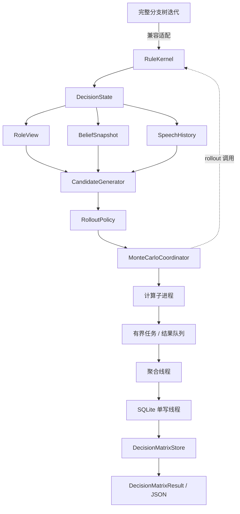
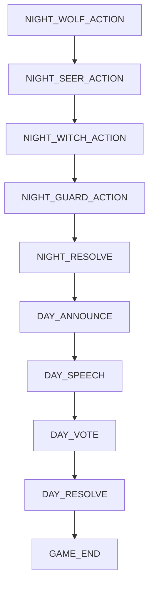
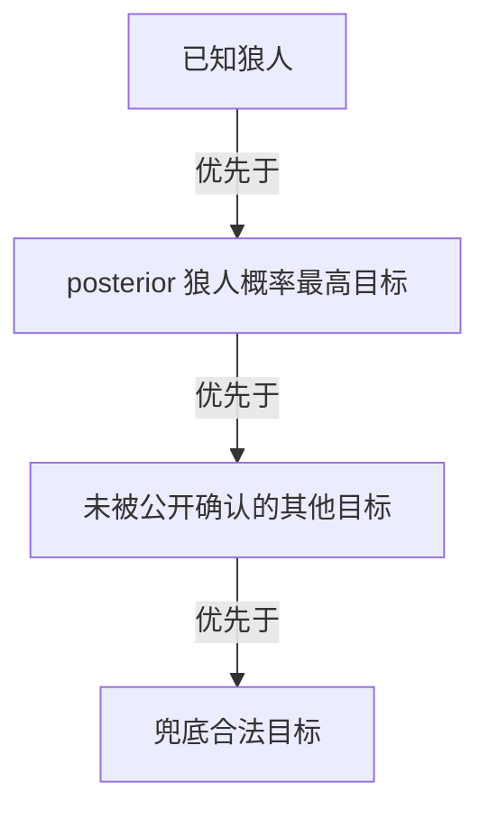
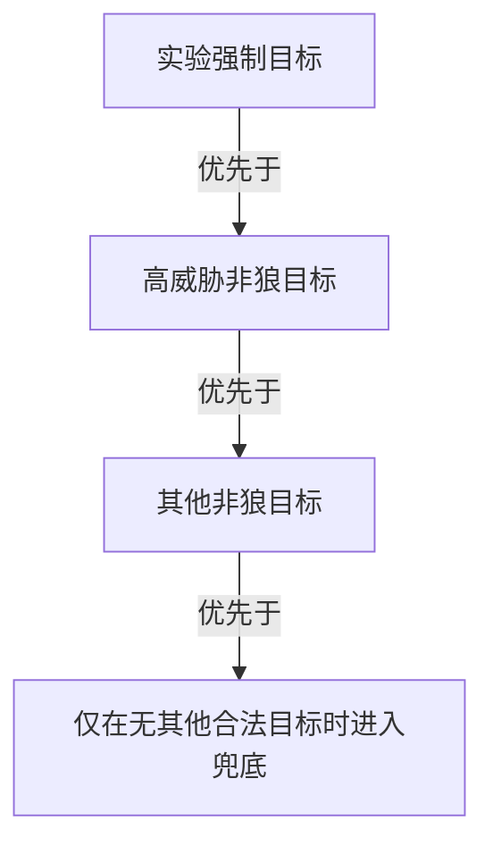
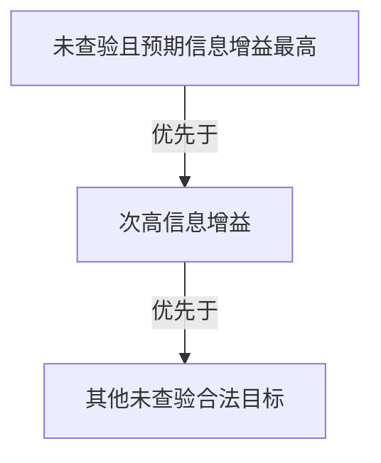
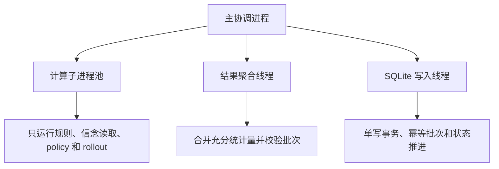
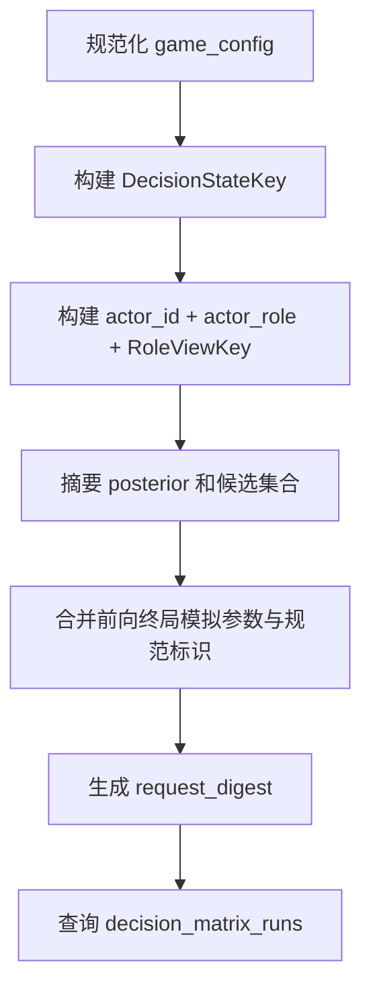
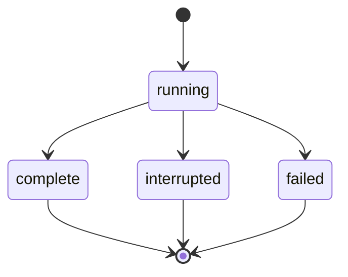
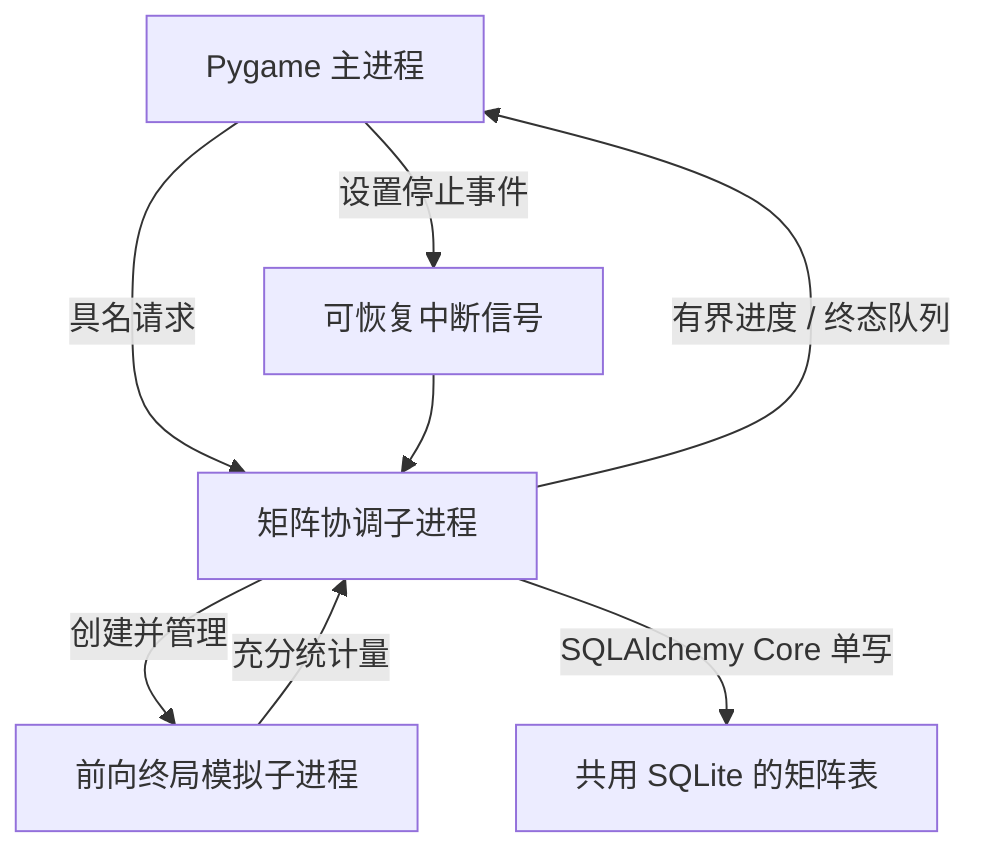

# 精确信念 Cheap-talk 决策矩阵代码设计方案

> 状态：精确信念 Cheap-talk 决策矩阵的设计与实现约束方案；实际完成事实、修正和验证结果见 `CODE_CHANGES.md`。
> 当前算法语义和数学公式以 `ALGORITHM_DESIGN_V3.md` 为准；实际完成的文件、迁移和验证结果只能在实现后写入 `CODE_CHANGES.md`。
> 文件名中的编号只用于文档沿革；代码标识符、docstring、日志、CLI、GUI 和输出必须使用具体算法名称或职责名称。

## 1. 设计目标

本方案在不删除完整分支树迭代、DAG、SQLite solution 和 GUI 兼容功能的前提下，增加一个与语言模型完全解耦的精确信念 cheap-talk 决策收益矩阵模块。

工程目标包括：

- 从现有模拟器抽取纯规则内核，并由旧模拟器适配回原接口；
- 增加逐席位发言、逐玩家投票和昼夜微阶段状态；
- 用行动者信息隔离的 posterior 驱动功利等级策略；
- 对结构化发言动作执行固定样本数的终局 Monte Carlo；
- 使用多进程、线程、有界消息队列、批次聚合、GC 边界和 worker 回收平衡吞吐与内存；
- 将矩阵结果写入现有 SQLite 文件中的新表；
- 按“对局配置、决策状态、行动者角色视角、动作和 rollout 参数”精确查询；
- 输出纯结构化矩阵，不处理语言模型响应。

## 2. 非目标

精确信念 Cheap-talk 决策矩阵第一阶段不做：

- 删除或改写完整分支树迭代的外部行为；
- 把 Monte Carlo 接入完整分支树的 wide/narrow interval；
- 保存完整 rollout 轨迹；
- 调用语言模型生成动作或采样后续玩家行为；
- 从历史对局拟合行为策略；
- 实现 MCTS、递归矩阵、minimax、纳什均衡或 PBE；
- 把完整分支树的 edge multiplicity 解释为概率；
- 通过自然语言文本构造缓存键。

## 3. 总体架构



核心依赖方向必须单向。规则内核不得反向导入策略、持久化、Pygame 或语言模型模块。

## 4. 建议文件映射

以下是拟议文件边界，只有实现完成后才能把它们写入 `CODE_CHANGES.md`：

| 拟议文件 | 职责 |
| --- | --- |
| `_rule_kernel.py` | 纯合法动作、单动作应用、结算和终局判断 |
| `_decision_state.py` | 顺序发言、投票和昼夜微阶段状态 |
| `_role_view.py` | 从真实状态构建行动者合法角色视角 |
| `_speech_action.py` | 一级动作族和二级具体 `SpeechPlan` |
| `_rollout_policy.py` | 优先等级、softmax 和各阶段算法策略 |
| `_decision_matrix.py` | 请求规范化、Monte Carlo 协调和结果组装 |
| `_decision_matrix_worker.py` | 无 Pygame、SQLAlchemy、greenlet 的纯计算 worker |
| `_decision_matrix_store.py` | 新表、事务、断点、幂等批次和查询 |
| `_simulator.py` | 保留旧入口，通过适配器调用共享规则逻辑 |
| `_game_state.py` | 保留完整分支树状态兼容，按需要增加可无损转换的决策字段 |

若实现时发现新增文件会制造循环依赖，应优先调整职责，而不是让规则内核导入上层模块。

## 5. 纯规则内核

### 5.1 接口原则

现有 `SearchSimulator.expand_state()` 一次性构造整个阶段的所有后继。前向终局 Monte Carlo 需要“只生成当前合法动作、只应用被选中的动作”。建议抽取以下纯接口：

```python
class RuleKernel:
    """执行狼人杀硬规则，不包含策略、行为概率、搜索和持久化。

    规则强制的随机结算只消费调用方注入的显式随机源。
    """

    def legal_actions(
        self,
        *,
        state: DecisionState,
        actor_id: int,
    ) -> tuple[RuleAction, ...]: ...

    def apply_action(
        self,
        *,
        state: DecisionState,
        action: RuleAction,
    ) -> DecisionState: ...

    def settle_phase(
        self,
        *,
        state: DecisionState,
        random_source: RuleRandomSource,
    ) -> DecisionState: ...

    def terminal_result(
        self,
        *,
        state: DecisionState,
    ) -> TerminalResult | None: ...
```

所有新增公共方法必须使用具名参数，并在中文 docstring 中说明输入视角、合法范围、返回值和失败方式。

### 5.2 规则与策略分离示例

守卫阶段：

- 规则层删除自己和上夜目标，返回剩余合法目标；
- 策略层根据行动者视角推导的受刀风险为目标评分；
- Monte Carlo 层只从策略层返回的概率分布抽取一个目标。

投票阶段：

- 规则层删除自己、死亡玩家和无投票权玩家；
- 战术层应用实验强制目标或禁止动作；
- 策略层按阵营和 posterior 评分；
- 平票结算由规则层使用显式均匀随机源处理。

### 5.3 完整分支树兼容适配

完整分支树入口继续返回完整 `StateTransition` 集合。适配器可以：

1. 从旧 `GameState` 转换为内部 `DecisionState`；
2. 枚举旧阶段需要的合法动作组合；
3. 对每个组合调用共享规则内核；
4. 恢复旧 `action_key`、multiplicity 和后继 `GameState`；
5. 保持 DFS/BFS、DAG 和持久化调用方不变。

必须用重构前后差分 fixture 证明旧动作键、后继状态、multiplicity 和终局结果逐值一致。修正规则缺陷时应通过显式兼容配置或单独变更记录处理，不能把兼容重构和规则变更混成一次不可审计修改。

## 6. 顺序化决策状态

### 6.1 拟议结构

```python
@dataclass(frozen=True, slots=True)
class DecisionState:
    """单步决策状态；只保存未来转移和合法信息所需字段。"""

    public_state: PublicGameState
    phase: DecisionPhase
    current_actor_id: int | None
    speech_order: tuple[int, ...]
    speech_cursor: int
    vote_order: tuple[int, ...]
    vote_cursor: int
    speech_events: tuple[SpeechEvent, ...]
    pending_votes: tuple[tuple[int, int], ...]
    pending_night_actions: tuple[RuleAction, ...]
    private_resources: PrivateResourceState
```

`DecisionState` 不能直接把全体真实角色暴露给策略层。真实隐藏世界由 rollout world 单独持有，策略查询必须经过视角投影。

### 6.2 微阶段建议



完整分支树的 `night/day` 状态可以继续存在于兼容层；决策矩阵内部不能用一次“整日 profile”替代逐席位公开发言。

## 7. 角色视角

### 7.1 数据结构

```python
@dataclass(frozen=True, slots=True)
class KnownRoleFact:
    seat_id: int
    role: str
    source: str


@dataclass(frozen=True, slots=True)
class KnownCampFact:
    seat_id: int
    camp: str
    source: str


@dataclass(frozen=True, slots=True)
class RoleViewKey:
    schema_version: int
    actor_id: int
    actor_role: str
    exact_role_facts: tuple[KnownRoleFact, ...]
    camp_facts: tuple[KnownCampFact, ...]
    team_facts: tuple[KnownCampFact, ...]
    public_role_facts: tuple[KnownRoleFact, ...]
```

所有 tuple 在构造时按席位、知识类型、值和来源稳定排序。内部席位 ID 使用稳定零基索引；UI 的一基显示编号不得进入摘要。

### 7.2 单一构造入口

```python
def build_role_view(
    *,
    world_state: WorldState,
    actor_id: int,
    rules: RuleConfig,
) -> RoleViewKey:
    """按规则白名单构造行动者硬知识，禁止调用方注入任意真值。"""
```

允许来源：

- 自身角色；
- 狼队依法知道的成员；
- 预言家私有阵营查验；
- 规则明确公开的真实身份。

禁止来源：

- 上帝视角完整站位；
- 死亡推断；
- 公开身份声明；
- posterior 排名；
- 自然语言解析结果中的推测身份。

### 7.3 示例

预言家二号位查验五号位为狼人：

```json
{
  "schema_version": 1,
  "actor_id": 1,
  "actor_role": "seer",
  "exact_role_facts": [
    {"seat_id": 1, "role": "seer", "source": "self"}
  ],
  "camp_facts": [
    {"seat_id": 4, "camp": "wolf", "source": "seer_check"}
  ],
  "team_facts": [],
  "public_role_facts": []
}
```

狼人一号位知道七号位属于狼队：

```json
{
  "schema_version": 1,
  "actor_id": 0,
  "actor_role": "wolf",
  "exact_role_facts": [
    {"seat_id": 0, "role": "wolf", "source": "self"}
  ],
  "camp_facts": [],
  "team_facts": [
    {"seat_id": 6, "camp": "wolf", "source": "wolf_team"}
  ],
  "public_role_facts": []
}
```

## 8. 结构化发言与两级矩阵

### 8.1 一级动作族

```python
class SpeechFamily(StrEnum):
    BASELINE = "baseline"
    ACCUSE = "accuse"
    SUPPORT = "support"
    VOTE_INTENT = "vote_intent"
    CLAIM_SEER = "claim_seer"
    SILENCE = "silence"
```

一级动作族最多六类，只承担摘要、折叠和导航功能。

### 8.2 二级具体动作

```python
@dataclass(frozen=True, slots=True)
class SpeechPlan:
    """可执行且可规范编码的具体发言计划，不包含自然语言文本。"""

    schema_version: int
    family: SpeechFamily
    identity_claim: str | None
    claim_target_id: int | None
    claim_result: str | None
    accuse_target_id: int | None
    support_target_id: int | None
    vote_intent_target_id: int | None
    intensity: str
    tactic: str
```

规范动作示例：

```json
{
  "schema_version": 1,
  "family": "claim_seer",
  "identity_claim": "seer",
  "claim_target_id": 4,
  "claim_result": "wolf",
  "accuse_target_id": 4,
  "support_target_id": null,
  "vote_intent_target_id": 4,
  "intensity": "strong",
  "tactic": "wolf_fake_seer"
}
```

动作摘要使用稳定字段顺序和枚举值。中文展示标签、自然语言文本和 prompt 不参与 action key。

### 8.3 候选生成

候选生成器依次执行：

1. 枚举当前角色和阶段的合法动作族；
2. 应用实验战术启用与禁止约束；
3. 展开目标和声明结果；
4. 按行动者 posterior 计算优先等级；
5. 保留所有同级目标；
6. 输出一级摘要和全部二级 concrete action。

如果六个目标完全同级，二级结果必须保留六个动作。不得用座位号、容器顺序或运行时随机数把它们缩成一个。

## 9. Rollout Policy

### 9.1 接口

```python
class RolloutPolicy(Protocol):
    """根据行动者合法视角返回完整离散动作分布。"""

    def action_distribution(
        self,
        *,
        state: DecisionState,
        actor_view: ActorView,
        legal_actions: tuple[RuleAction, ...],
        credibility: float,
        policy_config: PolicyConfig,
    ) -> tuple[WeightedAction, ...]: ...
```

返回分布必须：

- 覆盖全部合法且未被战术禁止的动作；
- 概率非负并归一化；
- 同级动作概率相同；
- 不读取其他玩家真实角色；
- 不调用语言模型；
- 不递归构建收益矩阵。

### 9.2 优先级到分数

建议以枚举表示五档等级，并由单一映射转换为 `1.00 / 0.75 / 0.50 / 0.25 / 0.00`。softmax 温度固定从配置读取，默认 `0.25`。

评分表应作为具有稳定规范标识的配置集中保存，例如：

```yaml
policy_spec: utility-ranked-rollout
temperature: 0.25
priority_scores:
  forced: 1.00
  camp_primary: 0.75
  role_primary: 0.50
  fallback: 0.25
  discouraged: 0.00
```

这是规范模型参数，不是从历史对局拟合的经验值。

### 9.3 阶段策略示例

好人投票：



狼人投票：



预言家查验：



守卫与女巫的目标分布必须从各自合法视角推导，不能从抽样世界真值直接排序。

实现时可将完整 posterior 只用于每条轨迹的隐藏世界抽样；rollout 热路径使用
由硬知识和公开结构证据确定性推导的边缘狼人评分，使用独立规范标识并写入策略
摘要。这样不把真实抽样站位泄露给未来行动，也避免每个动作重复枚举全部站位。

## 10. Monte Carlo 请求与结果

### 10.1 请求对象

```python
@dataclass(frozen=True, slots=True)
class DecisionMatrixRequest:
    """矩阵计算的完整规范输入；所有跨边界字段均显式命名。"""

    game_config: CanonicalGameConfig
    decision_state: DecisionState
    actor_id: int
    actor_role: str
    role_view: RoleViewKey
    belief_snapshot: BeliefSnapshot
    candidate_actions: tuple[SpeechPlan, ...]
    credibility_levels: tuple[float, ...] = (0.0, 0.5, 0.8)
    policy_temperature: float = 0.25
    samples_per_cell: int = 100
    seed_scheme: str = "indexed-common-random-numbers"
    base_seed: int = 0
```

`actor_role` 虽然也能从角色视角推导，仍显式保存以便查询、审计和错误检测。两处值不一致时必须拒绝请求。

### 10.2 输出对象

```python
@dataclass(frozen=True, slots=True)
class DecisionMatrixCell:
    action_key: str
    credibility: float
    sample_count: int
    reward_mean: float
    reward_standard_error: float
    baseline_delta_mean: float
    baseline_delta_standard_error: float
    scenario_counts: tuple[int, int, int, int, int, int]


@dataclass(frozen=True, slots=True)
class DecisionMatrixResult:
    matrix_id: str
    request_digest: str
    status: str
    action_families: tuple[ActionFamilySummary, ...]
    cells: tuple[DecisionMatrixCell, ...]
    versions: MatrixVersions
    model_scope_notice: str
```

输出对象不包含语言模型选择、自然语言发言或 prompt。

### 10.3 JSON 示例

```json
{
  "matrix_id": "...",
  "status": "complete",
  "actor": {"seat_id": 2, "role": "villager"},
  "credibility_levels": [0.0, 0.5, 0.8],
  "samples_per_cell": 100,
  "rows": [
    {
      "action_key": "...",
      "family": "claim_seer",
      "action": {
        "claim_target_id": 4,
        "claim_result": "wolf",
        "tactic": "villager_decoy"
      },
      "values": {
        "0.0": {"mean": 0.08, "se": 0.10, "baseline_delta": 0.02},
        "0.5": {"mean": 0.16, "se": 0.10, "baseline_delta": 0.10},
        "0.8": {"mean": -0.04, "se": 0.10, "baseline_delta": -0.08}
      },
      "direction_consistent": false
    }
  ],
  "notice": "模型条件 Monte Carlo 估计，不代表真实玩家或语言模型行为概率"
}
```

示例数字只展示结构，不是预期实验结果。

## 11. 并发设计

### 11.1 职责拓扑



默认计算子进程数为 `2`。实现后必须基准比较 `1 / 2 / 4` 个进程，只有端到端更快且峰值内存安全时才提高默认值。

### 11.2 任务切分

任务按“可信度档位 + 连续样本索引区间”切分。一个任务必须包含全部具体候选动作，使同一 worker 可以：

1. 为样本索引生成一次隐藏世界随机流；
2. 对所有候选复用该随机流；
3. 计算相对 baseline 的配对差；
4. 返回该样本区间的聚合统计量。

不按 action 独立切分随机任务，避免破坏 common random numbers。

起始批次大小建议为 `10` 个样本索引，仅作为工程调优默认值。批次大小不改变算法目标，但会影响暂停延迟、IPC 频率和临时内存，必须通过基准确认。

### 11.3 有界队列

至少使用：

- 有界任务队列；
- 有界结果队列；
- 父进程内部有界持久化队列。

队列满时生产者等待，形成背压。不得使用无界 Future 列表或让完整轨迹积压在父进程。

### 11.4 Worker 返回值

```python
@dataclass(frozen=True, slots=True)
class MatrixBatchAggregate:
    matrix_id: str
    batch_id: str
    credibility: float
    sample_start: int
    sample_end: int
    action_stats: tuple[ActionAggregate, ...]
```

每个 `ActionAggregate` 只包含：

- 完成样本数；
- reward 和、平方和；
- paired delta 和、平方和；
- 六类情景计数；
- 失败计数。

禁止跨进程传输完整轨迹、完整 DAG 或全部逐样本 GameState。

### 11.5 GC 与内存

- rollout 只保留当前轨迹状态；
- 每个样本结束立即释放临时状态和动作列表；
- 每个批次结束后检查需要回收的循环对象；
- 不在每条轨迹热循环强制执行全代 GC；
- 不在主进程全局关闭 GC；
- worker 完成固定批次数后退出并由进程池补充；
- 父进程在派发前后执行物理内存安全检查；
- 进入安全保留区时停止新任务、等待已提交批次落库并写为可恢复中断。

如果纯模拟对象经验证不存在引用环，可以在计算 worker 内采用“批次期间关闭循环 GC、批次边界显式恢复和收集”的局部策略；必须用压力测试证明不会积累循环垃圾，且不能改变父进程或完整分支树 worker 的 GC 设置。

### 11.6 确定性

每个随机值由以下字段稳定派生：

```text
request_digest
+ credibility
+ sample_index
+ random_source_name
+ seed_scheme_version
+ base_seed
```

禁止使用进程 ID、线程 ID、Python 随机哈希或任务完成顺序作为随机种子。不同 worker 数量和批次完成顺序必须得到逐值一致的聚合结果。

## 12. 同库持久化设计

### 12.1 总体原则

精确信念 Cheap-talk 决策矩阵与完整分支树迭代结果使用同一个 SQLite 文件，但创建职责独立的新表。新表不替代现有 `lru`、`memory`、`solution` 或图表。

所有建表、索引、查询、upsert、更新、统计和 schema 检查必须通过 SQLAlchemy Core/Inspector。计算 worker 不导入 SQLAlchemy，所有写入由父进程单一写入线程完成。

### 12.2 `decision_matrix_runs`

建议字段：

| 字段 | 语义 |
| --- | --- |
| `matrix_id` | 不可变矩阵运行标识，主键 |
| `request_digest` | 完整规范请求摘要，唯一 |
| `config_digest` | 影响未来转移的对局配置摘要 |
| `decision_state_digest` | 观察者安全决策状态摘要 |
| `actor_id` | 当前行动者席位 |
| `actor_role` | 当前行动者自知角色 |
| `role_view_digest` | 角色视角硬知识摘要 |
| `role_view_json` | 规范角色视角，供审计 |
| `posterior_digest` | 完整 posterior 内容摘要 |
| `candidate_set_digest` | 二级具体动作集合摘要 |
| `policy_digest` | 功利等级策略、温度、可信度和评分规范摘要 |
| `seed_digest` | 随机数方案和基准种子摘要 |
| `target_samples` | 每单元目标样本数 |
| `expected_cell_count` | 预期动作与可信度单元数 |
| `status` | `running/complete/interrupted/failed` |
| `error_summary` | 失败摘要，不替代完整日志 |
| `created_at/updated_at` | 审计时间 |

查询完整矩阵优先使用 `request_digest`；可读字段用于审计、索引和错误诊断。

### 12.3 `decision_matrix_rows`

建议复合主键：

```text
matrix_id + action_key + credibility
```

建议字段：

| 字段 | 语义 |
| --- | --- |
| `matrix_id` | 所属矩阵 |
| `action_key` | 规范二级动作摘要 |
| `action_family` | 一级动作族 |
| `action_json` | 规范具体动作 |
| `credibility` | `0 / 0.5 / 0.8` |
| `sample_count` | 已提交样本数 |
| `reward_sum/reward_sum_sq` | 收益充分统计量 |
| `delta_sum/delta_sum_sq` | 配对差充分统计量 |
| `scenario_counts_json` | 六类互斥情景计数 |
| `updated_at` | 最后聚合时间 |

均值和标准误优先从充分统计量派生，避免增量平均舍入误差成为唯一事实来源。

### 12.4 `decision_matrix_batches`

建议复合唯一约束：

```text
matrix_id + credibility + batch_id
```

建议字段：

| 字段 | 语义 |
| --- | --- |
| `matrix_id` | 所属矩阵 |
| `credibility` | 当前档位 |
| `batch_id` | 由样本索引区间稳定派生 |
| `sample_start/sample_end` | 半开样本区间 |
| `aggregate_json` | 本批充分统计量 |
| `status` | `committed/failed` |
| `committed_at` | 幂等提交时间 |

写入线程在一个事务内：

1. 插入或确认批次唯一记录；
2. 只对首次提交的批次累加 row 统计量；
3. 更新运行检查点；
4. 在全部单元计数通过校验后标记 `complete`。

重复结果消息不能造成二次累加。

### 12.5 查询路径



命中处理：

- `complete`：读取完整 rows 或按 action 查询单行；
- `interrupted`：校验批次与 row 计数后续算；
- `failed`：保留失败证据，显式创建新运行；
- 未命中或规范身份不同：创建新 `matrix_id`。

强制重算保留历史运行，并在请求摘要后追加运行标识后缀；基础摘要查询
仍应匹配并选择最新的 `complete` 记录，避免重算后只读缓存失联。

按 action 查询时使用：

```text
matrix_id + canonical_action_key + credibility
```

不为每个 action 重复存储整张矩阵。

### 12.6 完整性校验

只有同时满足以下条件才能标记 `complete`：

- 三个可信度档位齐全；
- 所有二级具体动作都有对应 row；
- 每个 row 的样本数等于目标样本数；
- 六类情景计数之和等于样本数；
- baseline row 存在；
- 所有 paired delta 使用相同样本索引集合；
- 已提交 batch 区间无重叠、无缺口；
- 请求、规则、策略和随机数规范标识与运行头一致。

## 13. 异常、暂停与恢复

### 13.1 状态机



每次运行最终必须进入三个终态之一。部分完成矩阵不得向上层伪装为可用排名。

### 13.2 Worker 失败

- 对同一个批次只使用相同样本索引和相同种子重试；
- 固定重试次数耗尽后，将运行标记为 `failed`；
- 不跳过失败样本并补抽新随机数；
- 父进程记录 worker PID、批次、matrix_id、样本区间和完整 traceback；
- 原生崩溃由进程池边界转换为可见失败。

### 13.3 可恢复中断

- 用户暂停或内存安全保护停止新任务；
- 已完成批次继续由单写线程提交；
- 未完整返回的批次不登记为 committed；
- 下次从首个缺失样本区间按原种子重算；
- 已完成批次不回滚。

## 14. 输出接口

建议提供：

- 返回不可变 `DecisionMatrixResult` 的纯 Python API；
- 返回 JSON-safe 字典的序列化 API；
- 可选 UTF-8 JSON 文件输出；
- 按完整矩阵或单 action 查询的只读 API。

不提供语言模型回调、prompt 注入或 response parser。上层系统可以自行把矩阵放入 prompt，但该行为不属于精确信念 Cheap-talk 决策矩阵。

## 15. 验证设计

### 15.1 规则内核差分

- 固定完整分支树的 GameState fixture；
- 保存旧动作键、后继状态、multiplicity 和终局结果；
- 抽取规则后通过兼容适配器重跑；
- 要求逐值一致；
- 对已明确修正的规则使用单独 fixture 和变更说明。

### 15.2 信息隔离

- 平民、女巫和守卫不能读取其他玩家真实角色；
- 预言家只获得阵营查验；
- 狼人只获得依法可知的狼队信息；
- 死亡不产生角色硬知识；
- public claim 不进入 `RoleViewKey`；
- 修改上帝视角中一个不可见角色但保持行动者 posterior 相同，矩阵请求键应保持一致。

### 15.3 候选与动作键

- 一级动作族最多六类；
- 二级同级目标全部保留；
- action key 与字典顺序、中文标签和自然语言文本无关；
- 同一动作跨进程和重启得到相同摘要；
- 真预言家不能伪造查验；
- 未启用战术不进入候选。

### 15.4 Monte Carlo 正确性

- 小型可完整枚举状态计算精确加权期望；
- Monte Carlo 多次独立运行的均值落在预设统计误差内；
- common random numbers 下 paired delta 与独立精确差一致；
- 改变候选遍历顺序不改变逐值结果；
- `1 / 2 / 4` worker 得到逐值相同统计量；
- 不允许早停或结果相关删样。

### 15.5 并发与持久化

- 小容量队列产生真实背压而不死锁；
- 重复 batch 消息不二次累加；
- worker 崩溃后相同 batch 重算；
- 中断后无缺口续算；
- `complete` 拒绝缺行、缺档位、样本不足和情景计数不一致；
- 所有 SQLite 操作使用 SQLAlchemy Core/Inspector；
- worker 导入图不包含 Pygame、SQLAlchemy、greenlet 或 LLM SDK。

### 15.6 内存与 GC

- 长时间 rollout 不保存完整轨迹集合；
- 记录父进程和每个 worker 峰值内存；
- 比较不同批次大小和 worker 数量；
- 验证 worker 回收后内存下降；
- 验证 GC 策略不积累循环垃圾；
- 触发内存安全线时进入可恢复中断而非失败或静默停止。

## 16. 推荐实施顺序

1. 先加入规则 fixture 和完整分支树差分测试，不改行为；
2. 抽取纯规则内核并让旧模拟器通过适配器调用；
3. 增加顺序化 `DecisionState` 和角色视角构造；
4. 增加两级结构化发言动作与规范 action key；
5. 接入角色视角精确信念快照；
6. 实现具有稳定规范标识的功利等级策略和三档可信度；
7. 实现单进程、固定种子的最小 Monte Carlo；
8. 在小型状态上与精确枚举交叉验证；
9. 增加计算子进程、有界队列、聚合线程和 GC/内存保护；
10. 在同一 SQLite 中增加三张矩阵表和断点恢复；
11. 提供纯 Python 与 JSON 输出；
12. 基准比较 `1 / 2 / 4` worker、批次大小和峰值内存；
13. 完成模块测试、DFS/BFS 兼容回归、SQLite 恢复和真实 GUI 启动验证；
14. 只有实际验证完成后更新 `CODE_CHANGES.md`。

## 17. 实施阶段的文档边界

- 算法公式、估计目标、信息约束和不变量只更新 `ALGORITHM_DESIGN_V3.md`；
- 计划中的文件、接口、表结构、并发拓扑和测试方案写在本文；
- 实际完成的文件、迁移和验证结果写入 `CODE_CHANGES.md`；
- 完整分支树迭代的历史工程事实继续保留在 `CODE_DESIGN.md`；
- 战术失败模式和工程注意事项同步维护在 `STRATEGY_IMPLEMENTATION.md`；
- 不把“计划实现”提前写成“已经完成”。

## 18. GUI 页面切换与矩阵计算

### 18.1 页面职责

GUI 使用同一 Pygame 主窗口提供两个互斥可见页面：

- “对局分支”页保留完整分支树参数、暂停/恢复、站位分页、检查点和结果统计；界面不得显示 DFS/BFS 等遍历实现名称；
- “发言收益”页只展示默认七人板子的站位方案、当前玩家、模拟次数、重新计算和结果阅读；worker 数、批次大小、缓存、SQLite 与进程拓扑不作为 Demo 输入或说明文字；
- GUI 不提供 SQLite 路径输入或修改控件。矩阵协调器固定使用本次 GUI 会话中完整分支树迭代的 `signature_cache_db_path`，默认文件名为 `search_simulator_cache.sqlite3`，决策矩阵继续只读写职责独立的矩阵表；
- 页面切换只改变可见控件和绘制区域，不销毁正在运行的任务，也不改变算法请求身份；
- 同一时刻只允许一个页面启动计算。另一个页面可以查看，但其启动按钮保持不可用并显示占用原因。

GUI 面向具有部分理论基础但不了解本项目目的的展示观众。页面开头只用一到两句说明“比较当前玩家发言方式在不同可信程度下的预期结果”，不展示 posterior、rollout、common random numbers、Monte Carlo、SQLite、进程、规范摘要或文档编号。必要的统计术语使用中文短标签，并通过 hover 给出一行解释。

发言收益页使用一基席位编号供研究者输入，在 GUI 到计算边界显式转换为内部零基 `actor_id`。站位编号保持既有 `1..1260` 语义。页面固定展示三个可信度档位，列名使用“忽略发言 / 中等影响 / 较强影响”，不提供把三档合并成单一分数的控件。

全部 GUI 文本，包括页签、按钮、标签、表头、状态、校验错误、hover、空状态和弹窗，都必须通过 `_i18n.py` 的 `t()` 按语义键读取；中文和英文资源必须同时存在。GUI 当前固定显示中文，但代码不得以硬编码中文绕过文案层。日志消息同样从 `t()` 获取，变量只通过命名占位符传入，以保证一次运行内语言一致。

数据库路径在 GUI 初始化时解析为绝对路径并保存为会话内只读值。页面切换、输入焦点、矩阵重算和断点恢复均不得改变该值；CLI 的独立矩阵入口仍可为隔离实验显式传入其他数据库路径，但这项能力不暴露到 GUI。

### 18.2 进程与消息拓扑



Pygame 事件泵、控件更新和绘制只能在主进程执行。矩阵协调器必须位于独立、非 daemon 子进程，因为它还要创建 rollout worker。协调器模块不得导入 Pygame；rollout worker 继续禁止导入 Pygame、SQLAlchemy、greenlet 和语言模型 SDK。

GUI 与协调器之间使用有界队列。协调器只发送运行标识、已提交批次数、总批次数、最近可信度与样本区间、终态和最终 JSON-safe 矩阵；不发送轨迹、隐藏世界或完整 GameState。GUI 每 `0.5` 秒批量消费进度消息，正常帧循环继续处理点击、hover、页面切换和窗口事件。

### 18.3 运行与恢复语义

- 默认点击“开始分析”先查询同一规范请求的 `complete` 结果；命中时直接展示，不在主页面暴露缓存术语；
- “重新计算”生成新的矩阵运行，不覆盖历史记录；
- 点击“停止”只设置跨进程停止事件。协调器停止派发新批次，等待已返回批次幂等落库后写为 `interrupted`；
- 页面关闭时优先请求可恢复中断并等待协调器退出。只有协调器在限定时间内仍无响应时才终止进程；未完整提交的批次下次按原索引和种子重算；
- `complete`、`interrupted` 和 `failed` 使用不同中文模态弹窗；弹窗正文先说明是否完成，再显示恢复进度和日志路径，内部状态值不直接作为用户文案；
- 协调器捕获的 Python 失败必须写入本次 crash 日志，再通过终态队列通知 GUI。异常退出且没有终态消息时，由 GUI 根据子进程退出码生成可见失败。

### 18.4 结果表与详情

矩阵主表按二级具体动作分页，每行同时展示“忽略发言 / 中等影响 / 较强影响”三档的收益均值和相对基线差值。行 hover 必须有可见底色，点击后在详情区展示：

- 一级动作族、目标、声明角色、声明查验、强度和战术标签；
- 三档收益均值、模拟误差、相对基线差值、差值误差和样本数；
- 六类互斥反应情景计数；
- 行动者角色和“结果只适用于当前规则与假设”的简短提示；矩阵标识、请求摘要、缓存状态和工程拓扑只进入日志或诊断弹窗。

详情使用中文字段和席位编号，不直接渲染 JSON、Python 字典或完整规范动作键。矩阵结果只读展示，不把研究者在 GUI 中的选中行、页码或 hover 状态写回 SQLite。

## 19. 外部 Python 调用门面

外部模块调用规范详见 `MATRIX_API.md`。公开门面固定分为三层：

1. 输入构造层接收可选的固定板子配置、可选的观察者安全决策状态和行动者合法角色视角，补齐固定默认值、完成严格字段校验并在模块内部生成全部二级候选动作；
2. 计算层接收独立的数据库与资源参数，复用现有矩阵协调器并返回 JSON-safe 完整结果；
3. 查询层使用同一规范输入、稳定动作键和可信度档位读取已完成单元格，不启动隐式计算。

输入 payload 不接受完整隐藏站位、自定义候选集合、自然语言文本、自定义可信度、自定义功利等级策略或数据库表字段。角色数组只表示无序角色多重集合；行动者角色视角必须与公开决策状态使用同一个零基席位。

默认参数以固定七人研究板子为边界：省略配置时使用两狼、两民、预言家、女巫和守卫及固定微阶段规则；省略公开决策状态时使用当前行动者的首日全员存活发言状态；省略角色视角中的确切角色与自身阵营时由 `actor_id` 和 `actor_role` 补齐。完整七人隐藏站位不是接口参数。狼人队友席位和预言家昨夜查验属于无法推导的私有事实，接口不得生成或猜测：狼人必须显式提供自己与队友的狼阵营席位，固定首日的预言家必须显式提供恰好一条查验及其阵营结果。

接入真实对局时，外部模块必须在当前发言前从同一个已提交游戏状态生成原子快照。公开存活状态、发言顺序、已发生结构事件与公开身份进入观察者安全决策状态；上次守卫目标和女巫药物余量作为受保护规则运行状态只参与合法动作与结算；行动者自身角色、狼队友阵营站位和自身预言家查验只进入角色视角。完整隐藏站位、其他玩家未公开的角色与私有行动不得进入请求。快照之后发生任何影响状态或知识的事件都必须形成新请求身份，不得复用旧矩阵。

数据库路径、worker 数、批次大小、内存安全线、进度回调、停止事件和强制重算属于执行参数，不进入 payload。样本数和基准种子属于估计目标，必须进入规范请求身份。外部调用仍遵循完整结果优先、可恢复中断续算、失败不返回部分排名的状态语义。

公开门面只从包根导出。计算 worker 的导入图不得因新增门面而提前加载 SQLAlchemy、Pygame、greenlet 或语言模型 SDK；包根继续使用惰性导出。Windows 多进程调用方必须使用主模块入口保护。
