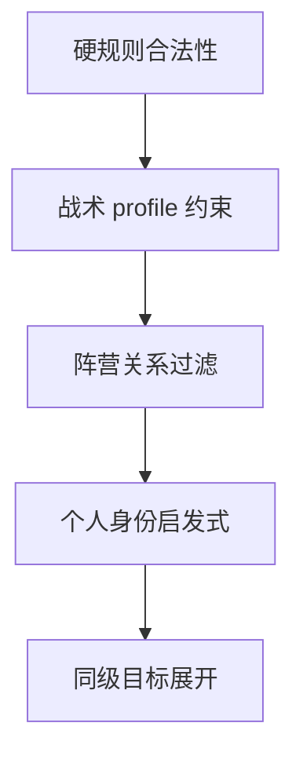

# 战术与智能投票实现说明

> 本文讨论战术与决策矩阵的工程实现难点，不重复 `ALGORITHM_DESIGN_V3.md` 中的数学设计；有限隐藏世界精确信念与完整分支树迭代文档只用于回看历史设计。精确信念 Cheap-talk 决策矩阵的拟议文件、接口、并发和表结构详见 `CODE_DESIGN_V3.md`。文档文件名中的编号只表示沿革，不作为算法名称。

## 1. 优先级管线

每次生成投票或狼刀目标时，必须使用统一管线：

不能先用智能过滤删除目标，再尝试恢复战术目标；这样会让战术优先级失效。

## 2. 游戏视角信息隔离

真实角色只用于规则结算和上帝视角 UI。目标过滤必须通过行动者可见信息构造：

- 狼人可见狼队成员；
- 预言家可见私有查验；
- 其他好人只可见公共确认与公共声明；
- 死亡本身不产生身份公开；
- 愚者放逐揭示属于规则事件。

不要复用包含真实角色的站位数据直接筛选好人投票目标，否则会产生隐藏身份泄漏。

## 3. 白天战术

### 3.1 村民挡刀

- 平民在自己的公开发言位置宣称为预言家，但真实角色不改变；
- 分别标记其处于发言顺序前四位或后三位，不能用固定席位号替代实际发言位置；
- 声明进入公共历史，后续玩家只能读取已经发生的发言；
- 完整假跳预言家必须给出一个其他存活席位及好人或狼人结果；只声明身份但不给查验属于独立弱声明动作；
- 狼人可以把公开神职声明作为后续判断依据，但不能因此知道声明者的真实角色。

### 3.2 预言家不发言

- 预言家仍经过自己的发言位置，私有查验不进入公共信息；
- 精确信念 Cheap-talk 决策矩阵固定使用显式主动沉默事件：发言位置正常经过，自然语言内容为空；不得随机退化为拒绝声明或最短占位文本；
- baseline 中预言家必须提供有效发言，不能误入“不发言”分支；
- 预言家死亡后不会因为死亡自动公开私有查验。

### 3.3 狼人悍跳预言家

- 狼人在公开发言中宣称自己是预言家，但真实角色和狼队私有信息不改变；
- 分别标记其处于发言顺序前四位或后三位；
- 完整悍跳必须给出一个其他存活席位及好人或狼人结果；是否启用悍跳仍由实验配置显式给出；
- 不得读取上帝视角后自动构造对狼人最有利的查验谎言；
- 声明进入公共历史并影响后续发言和投票目标集合。

## 4. 黑夜战术

### 4.1 狼人自刀骗解药

- UI 可用性由角色配置中的女巫/守卫决定；
- 运行时合法性还需要检查存活狼人不少于 2；
- 每名存活狼人分别成为自刀目标；
- 狼队基线正常刀口仍保留；
- 守卫、女巫和其他角色行动继续组成笛卡尔积；
- 自刀未被保护时正常杀死狼人；
- 死亡后狼身份不向好人公开。

### 4.2 狼人空刀

- 仅在存在女巫或守卫的配置中可用；
- 空刀使用显式的无目标 action，而不是虚构目标；
- 守卫、女巫、预言家仍正常行动；
- 女巫毒药仍可能造成死亡；
- 空刀与自刀是不同 profile，不组合成一个夜晚动作。

### 4.3 当前实验 baseline 与提示层级

- 当前第一天 cheap-talk 实验把夜间战术视为扩展控制变量，不得把自刀或空刀的收益混入三个白天主战术；
- baseline 不启用平民跳预言家和狼人悍跳，预言家必须有效发言；
- 启用战术由实验配置决定，并以 system-level 约束注入；未启用战术不得先进入 system prompt 再依赖 chat prompt 覆盖；
- chat prompt 中的“不要触发战术”只可作为 baseline 的冗余约束；
- 每个处理单元至少 10 局独立重复，但重复均值只标记为经验结果，不作为理论无偏期望。

## 5. 愚者交互

- 愚者放逐不是普通死亡；
- 第一次放逐消耗“身份揭示”，记录公开身份并结束白天；
- 愚者不进入死亡链；
- 后续票型构造必须从 voter 集合移除愚者；
- 智能模式的 target 集合也移除已揭示愚者；
- 愚者继续进入存活神职判定；
- 若 API 注入已经揭示但技能未消耗的矛盾状态，应在输入校验时拒绝或规范化。

## 6. 同级目标与票型

同级目标全部展开，因此智能模式仍可能形成多个个人投票组合。不能用票数向量、座位号或“第一个候选”替代完整 GameState；只有在未来转移完全等价时才允许由 DAG 合并状态。

白天完整票型属于公开历史。只有当未来转移不再依赖每名玩家的具体投票时，才允许用票数向量或其他充分统计量做无损概率聚合；否则相同放逐结果下的不同公开票型仍是不同状态。平票固定为最高票并列者中均匀随机放逐：完整分支树路径显式保留每个并列结果，前向终局 Monte Carlo 按明确均匀分布采样；任何路径都不能用座位号裁决。

票型路径计数可以独立记录 multiplicity，但它不能改变状态等价、子节点集合或 interval 回传。任何为了节省计算而删除同级目标的做法都必须证明未来转移完全等价，并把被合并的动作、目标和战术原因全部保留在边原因中。

## 7. DAG 合并与边原因

状态键只包含影响未来转移的字段。以下字段遗漏会产生错误合并：

- 愚者揭示状态；
- 公共身份声明；
- 公共阵营确认；
- 私有查验；
- 技能剩余次数；
- 守卫上夜目标；
- 次夜战术目标；
- 当前 phase。

多个 action 到达同一子状态时，父子关系只保存一次，但原因数组必须完整保留。每个原因包含：

- 稳定 action key；
- 中文可读标签；
- 战术类别；
- 目标席位；
- multiplicity。

Pygame 默认隐藏边上的常态原因标签；鼠标悬停折线时显示完整原因标题和全部原因行，不能只显示 variant 数量或截断前几行。节点 hover 仍显示完整 GameState，节点选中详情可作为边原因的辅助检视。

## 8. LRU 与 SQLite

LRU 热缓存只保存状态签名映射。不要把 interval、reward、路径数、边原因或 UI 展开状态放入 LRU key。

SQLite 仍由协调进程单写。schema 迁移需要兼容旧节点的单 reward 区间和旧边的单 action：

- 旧 reward 可迁移到 wide，narrow 初始复制后由重新计算覆盖；
- 旧 action 转换成单元素原因数组；
- 新原因 JSON 使用稳定排序，保证结果可复现；
- 路径大整数继续用 TEXT。

## 9. Pygame 事件与绘制

- GUI 面向具有部分理论基础但不了解本项目目的的展示观众；页签、按钮、状态和 hover 只解释任务与结果，不显示 DFS/BFS、文档编号、SQLite、posterior、rollout、共同随机数或进程拓扑；
- GUI 与日志中的全部自然语言文本必须通过 `_i18n.py` 的 `t()` 获取，中英文资源同步维护，动态值通过命名占位符传入；不得在绘制、控件更新、异常分支或 logger 调用点硬编码中文/英文句子；
- Pygame 事件泵和所有 surface 绘制只运行在主线程；
- 搜索始终在隔离子进程中运行，即使只有一个 worker；worker 不得导入 Pygame、SQLAlchemy 或 greenlet；
- 父进程通过有界进度/结果队列接收站位摘要、节点批次和边批次，队列满时形成背压；不得把整棵 DAG 作为 Future 结果返回；
- GUI 关闭、暂停或恢复都通过显式事件/信号传递，worker 不直接调用 Pygame API；
- GUI 关闭时必须等待协调器记录终态或可恢复中断，不能把窗口关闭误记为完成；
- 进度、节点批次和边批次在协调器侧按 0.5 秒批量消费；Pygame 事件泵、hover、点击、暂停/恢复和淡入动画仍按正常帧率处理，不能用批次轮询代替交互循环；
- DAG 大图只绘制视口内节点和边；
- DAG 采用固定网格布局：横向网格列对应节点的迭代深度，列间距固定且保留真实深度空档；同一深度内按稳定节点编号从上到下占用网格行，行间距固定，避免自适应压缩造成节点重叠；
- DAG 视口必须绘制带数字刻度的横轴，深度列以竖向虚线分隔并标注 `D0`、`D1` 等坐标；网格线和坐标只属于可视化，不进入状态签名、DAG 合并或 interval；
- 缩放后文字可按阈值隐藏，选中详情保持完整；
- 边颜色只读取 wide interval；
- 真实身份、公共声明和查验 icon 使用不同形状，不只依赖颜色。
- 页码、缓存统计和进度使用独立行或独立矩形槽位，禁止在同一坐标重复绘制；
- pygame_gui 原生控件与自绘区域都必须具备一致的 hover 反馈，自绘边 hover 时显示完整原因而不是仅依赖截断标签；边 hit-test 不能把节点 hover 或拖拽状态误判为边 hover。
- λ 滑块变化只重算当前选中 DAG 的 interval；不得重新提交搜索任务，也不得把新 interval 写回状态签名。大图重算需要保持 UI 事件泵可响应，其他站位采用选中时惰性刷新。
- 实时统计以已完成站位回调为一致性边界，累计值必须单调更新；路径占优是当前已完成样本的分支计数关系，不冒充概率。
- 节点表面只画编号和阶段色点，详情由 hover/选中面板承担，避免节点标签互相遮挡。

## 10. 运行恢复、终态与崩溃证据

- 全站位调度遵循“一个站位完整搜索、完整持久化并提交检查点，再进入下一个站位”；不得并发展开多个站位；
- 站位内临时 DAG 的节点和边数量未通过完整性校验前，不得写入可跳过的 solution 检查点；恢复时只重算当前未完成站位；
- 运行只能进入 `complete`、`interrupted` 或 `failed` 三种互斥终态。`failed` 必须记录 PID、线程、run_id、已完成/总站位、下一恢复站位和完整 traceback；
- 父进程必须把 worker 的 `BrokenProcessPool`、原生崩溃或持久化异常转换为可见失败事件，不能表现为静默停止；
- 每次启动在模块根目录创建一个按启动时间戳命名的 UTF-8 crash 日志。同一次运行的父进程和 worker 共用该文件，正文记录实际 PID，但文件名不追加 PID；失败归类时文件不能为空；
- GUI 需要为完成、中断、失败分别显示不同弹窗。若 GUI 进程被 access violation 直接终止，下一次启动必须提示最近一个非空且未确认的 crash 日志；
- 测试或压力运行结束后应删除临时 SQLite、JSON、图片和隔离目录，但保留正式检查点和 crash 证据。

## 11. 战术树交互

战术区域包含两个可折叠分组：白天和黑夜。每个分组标题拥有独立展开箭头，子项使用复选框。白天组显示平民跳预言家、预言家不发言和狼人悍跳预言家；涉及发言位置的战术还需要明确前置位前四/后置位后三的实验标签。黑夜组显示狼人自刀和狼人空刀，并提示它们不是当前 cheap-talk 收益矩阵的主处理变量。

智能投票关闭时：

- 整个战术区域隐藏；
- 已保存的勾选状态可以保留在 UI 内存中；
- 提交运行参数时战术集合必须为空。

智能投票重新开启后恢复之前的勾选状态。角色配置不满足黑夜战术条件时，对应复选框禁用并显示原因。

## 12. 观测窗口与数据一致性

- 实时 DAG 是有界观测窗口，不是完整图的替代品；丢弃旧预览节点只能影响显示，不得影响搜索、SQLite DAG、状态签名或最终 interval；
- 节点首次进入可见子树时淡入，后续同一节点更新不重复闪烁；全部展开/收起只改变本地可见集合；
- 节点 hover 必须从无损紧凑快照按需重建 GameState，用中文分区、逐行玩家卡片展示，不能直接输出 JSON 或 Python 字典；
- 搜索计数、路径汇总、节点 interval 回传和边 interval 同步属于不同阶段，UI 必须分别显示处理量/总量，不能把任一后处理比例解释成搜索完成概率；
- lambda 只改变已固定 DAG 的 wide/narrow 观测；滑块变化不得重新提交搜索任务或改变 LRU；
- 边颜色始终基于子节点 wide，narrow 只用于观测显示；
- 视觉回归必须观察根节点定位、深度从左到右、同层从上到下、节点展开/收起、边原因 hover 和节点完整 GameState hover。

## 13. 需要重点测试的失败模式

- 好人投票读取真实隐藏身份；
- 预言家私有查验泄露给其他玩家；
- baseline 仍收到 system-level 战术指令，仅靠 chat prompt 声称禁止战术；
- 把平民或狼人跳预言家的虚假查验范围按旧规则自行补全；
- 用固定席位号代替真实发言顺序判断前置位/后置位；
- 预言家“不发言”在不同运行中随机变成空文本、拒绝声明或普通发言；
- 把至少 10 局经验均值标记成无偏决策期望；
- 忽略已冻结的均匀平票规则，改用座位号裁决或只随机保留一个验证分支；
- 把夜间战术效果混入第一天白天 cheap-talk 收益；
- 愚者揭示后仍产生投票；
- 愚者放逐错误触发死亡链或二次投票；
- 自刀在单狼局面生成；
- 无女巫/守卫时空刀仍可勾选；
- 战术目标被智能过滤覆盖；
- 同级目标被固定座位 tie-break 删除；
- 合并等价状态后只留下一个原因标签；
- interval 错误使用 multiplicity；
- 同号 wide interval 仍按端点绝对值差判黑，掩盖已经明确的阵营方向；
- narrow 倒置后未交换；
- narrow 影响边颜色；
- GUI 意外提交 BFS；
- worker 线程直接绘制导致 Pygame 崩溃；
- 单站位未完成却被 solution 跳过；
- 空 crash 日志或失败弹窗误显示为完成；
- 结果队列无界积压导致父进程内存持续增长；
- 边 hover hit-test 误选相邻节点，或原因列表被截断；
- 实时预览丢弃节点后修改完整 DAG 或路径计数；
- 动态 lambda 重算阻塞 Pygame 事件循环；
- 同符号 wide interval 被错误按绝对值比较而显示黑色；
- narrow 反转后没有交换上下界；
- GUI 视觉布局把深度画成纵轴，或同层节点顺序不稳定。

## 14. 精确信念 Cheap-talk 决策矩阵工程边界

### 14.1 规则复用而不删除旧功能

精确信念 Cheap-talk 决策矩阵应从现有模拟器抽取无策略、无行为概率的纯规则内核；规则强制的随机结算只消费显式注入的随机源。完整分支树迭代通过兼容适配器继续获得原有完整分支。抽取前后必须对固定状态执行差分测试，逐值比较动作键、后继状态、multiplicity 和终局结果。完整分支树的 DAG、LRU、solution 和 interval 不进入前向终局 Monte Carlo。

### 14.2 两级动作与同级目标

一级动作族最多六类，只用于摘要：baseline、指控、支持、投票意向、跳预言家和沉默。二级具体动作展开目标、查验结果、强度和战术标签。Monte Carlo 和数据库 action key 均以二级动作为准；同级目标全部保留，不能为满足一级展示上限而按座位号裁剪。

### 14.3 RoleView 与查询隔离

矩阵请求显式包含行动者席位和 `actor_role`，并通过单一白名单入口构建角色视角：

- 自身确切角色；
- 狼队依法知道的队友席位与狼人阵营；
- 预言家私有好人/狼人查验；
- 规则明确公开的真实身份。

公开声明、死亡、怀疑和 posterior 排名不进入硬知识。完整真实站位不得进入行动者矩阵查询键或输出。第一版不进行跨行动者座位重标复用。

### 14.4 固定算法 Policy

rollout policy 按“硬规则、战术硬约束、阵营目标、身份启发式、同级动作”评分，五档规范分数为 `1 / 0.75 / 0.5 / 0.25 / 0`，softmax 温度为 `0.25`。同级动作必须同概率。发言证据强度固定观察 `0 / 0.5 / 0.8` 三档，零档表示忽略发言证据，不表示声明必假。

policy 不调用 LLM、不读取历史对局、不递归构建矩阵，也不从抽样世界真值为当前模拟行动者排序。

隐藏世界抽样使用完整行动者 posterior；前向终局模拟热路径的目标排序使用由硬知识
和公开结构证据确定性构造、具有稳定规范标识的边缘评分投影。该投影属于显式行为模型，
不改变 Monte Carlo 所针对的模拟分布。

### 14.5 Monte Carlo 与失败处理

每个二级具体动作、每个可信度档位固定执行 100 条终局轨迹。相同样本索引下所有候选共享隐藏站位、后续行动和平票随机流。不得中途看到领先后提前停止，也不得丢弃失败样本后换种子补抽。

单批失败只允许用原样本区间和原种子固定次数重试；仍失败则整张矩阵进入 `failed`，不能向上层输出部分排名。内存保护或用户暂停进入 `interrupted`，已完整提交批次保留，未提交批次按原索引重算。

### 14.6 并发与内存

- CPU rollout 使用隔离计算子进程，默认两个 worker；
- 线程只承担父进程聚合和 SQLite 单写，不执行 CPU 密集 rollout；
- 任务按“可信度档位与样本索引批次”切分，一个任务计算全部候选；
- 任务、结果和持久化队列均有界，队列满时形成背压；
- worker 只返回 count、sum、sum of squares、paired delta 和六类情景计数；
- 完整轨迹、完整 GameState 集合和 DAG 不跨进程传输；
- GC 只在批次边界管理，不在逐轨迹热循环强制全代回收；
- worker 完成固定批次数后回收，父进程持续执行物理内存安全检查。

### 14.7 同库新表

精确信念 Cheap-talk 决策矩阵与完整分支树迭代使用同一 SQLite 文件，但使用独立的矩阵运行、矩阵行和幂等批次表。所有数据库访问继续使用 SQLAlchemy Core/Inspector，计算 worker 不导入 SQLAlchemy。查询先用对局配置、观察者安全状态、行动者角色视角、posterior、候选集合、功利等级策略、样本数和种子方案定位矩阵，再用 matrix ID、具体 action key 和可信度定位单元格。

`complete` 结果可直接读取；`interrupted` 校验计算单元后恢复；`failed` 保留失败证据并显式新建运行。不同规则、功利等级策略、角色视角、精确信念或参数规范不得命中旧矩阵。

### 14.8 额外失败模式

- 把完整真实站位或其他玩家角色写入 RoleView；
- 把 `actor_role` 与 RoleView 自身角色记录成不一致值；
- 用完整分支树 multiplicity 作为 Monte Carlo 行动概率；
- 一级最多六类被错误实现为二级最多六个目标；
- 三个可信度档位被平均成一个未经定义的分数；
- softmax 温度和发言证据强度共用同一个参数；
- 按 action 分进程后没有复用共同随机数；
- 进程数、任务完成顺序或 Python hash 改变矩阵结果；
- 重复 batch 消息导致充分统计量二次累加；
- 部分 row 样本不足仍把矩阵标记为 complete；
- GUI 暴露独立的矩阵数据库路径输入，导致完整分支树与决策矩阵被研究者误写入不同 SQLite；
- 计算 worker 导入 Pygame、SQLAlchemy、greenlet 或 LLM SDK；
- 为调试保留全部 rollout 轨迹导致内存随样本数线性增长；
- 将 Monte Carlo 标准误解释为规则、policy 或真实行为的不确定性。
